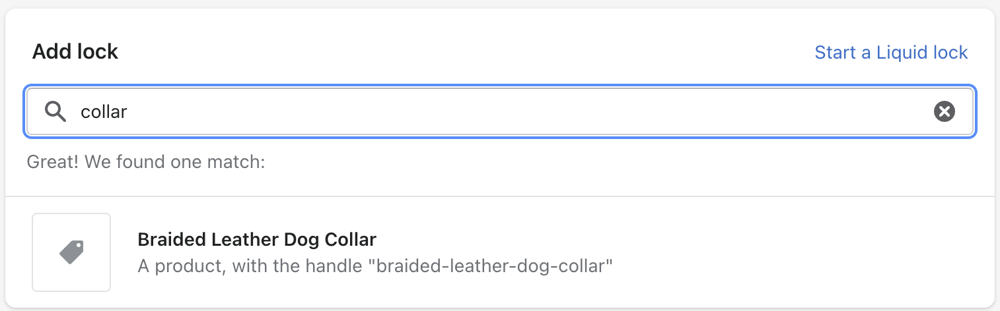
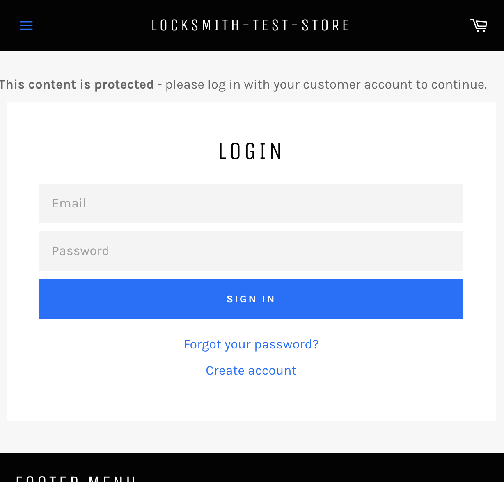
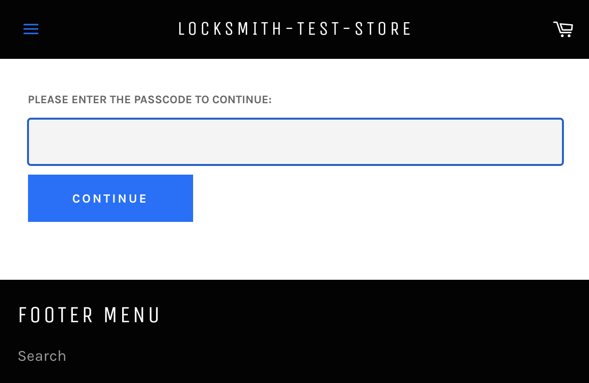

# Quick Start

Locksmith is a tool for merchants on Shopify to restrict access to the content in the "Online Store" sales channel of their Shopify store. It's a simple tool, and in some cases can be set up in only a few minutes.

### To get started, open up Locksmith from your apps list.

You'll be presented with the main page. The "Add new lock" section will be your first stop:

<figure><figcaption></figcaption></figure>

For a more detailed overview of what Locksmith is and how the app works, see our guide linked below:


[overview.md](basics/overview.md)


### Create your first lock

To restrict access to something in your store, simply type in the name of a product, collection, page, variant, etc - you'll immediately start seeing search results. Alternatively, select a type from the dropdown to filter your search by resource type. Select the resource that you want, to place a lock on it:


**Note:**  This input does not work with URLs.


More information on (and help troubleshooting) lock creation here:


[creating-locks.md](basics/creating-locks.md)


### Create a key

On the next page, press the "Add key" button to create a key:

<figure><figcaption></figcaption></figure>

Next, add at least one condition to your key. The most commonly-used key conditions will show up first, but **you can search or keep scrolling for more options.**

<figure><figcaption></figcaption></figure>

Simply select the condition that you want to use. Some conditions may ask you for some additional settings, you'll be prompted if appropriate.

**There are over 20 out-of-the-box key conditions**, and you can even create custom conditions! You can also combine key conditions in different ways to create unique access scenarios. For more information on that, and the complete list of key conditions, see the page here:


[creating-keys.md](basics/creating-keys.md)



**Note**: If you don't want to hide your product pages entirely, and instead only want to hide specific content on the product page, such as the prices or add-to-cart, we call this "manual locking", and it takes a couple extra steps beyond this guide. To get started with this, [check out our guide on that here](tutorials/hiding-prices.md).


### Wait for Locksmith to install to your theme

After you **save the lock**, Locksmith will usually take about 5-10 seconds to automatically update your theme. A green status bar will briefly show at the bottom of the page - once it is gone, the installation has finished.

You can now navigate to your locked content on your store front, and you should immediately see the restriction is now in place. Locksmith will automatically show the appropriate content, using the styling from your theme, on the page. The access denied content will correspond to the key condition that you used.&#x20;

So, for example, if you chose a condition requiring a sign-in:

Or, if you chose a passcode-only entry method, you'll see a different prompt:

Each key condition type will have a slightly different landing page, the above two examples are not a complete list. The messages displayed on these pages can be customized as much as you need:


[customizing-messages.md](tutorials/more/customizing-messages.md)



**Important**: The Locksmith app only restricts content inside the "Online Store" sales channel. It won't work inside of other sales channels such as the Buy Button or the Wholesale sales channel. Additionally, Locksmith and the Shop App sales channel are incompatible and cannot be used at the same time.

