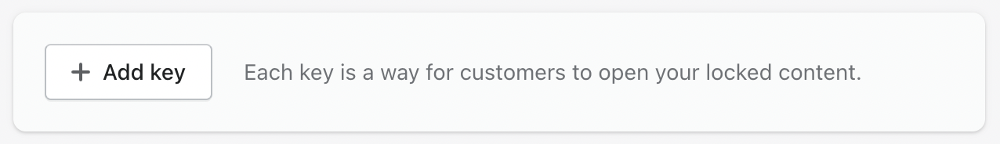

# Creating keys

Once you [create a lock](creating-locks.md), you'll need to create _keys_ – simple statements that describe the conditions for access. For example, one might have a key that says "Permit if the customer is signed in". In this example, the _key condition_ is "if the customer is signed in".

Keys are added, unsurprisingly, inside of the "Keys" section on the lock page:

<figure><figcaption></figcaption></figure>

Press that "Add the first key" button, and you'll be presented with the full list of key conditions that are available to you. There are quite a few options here!

These are all the key conditions that Locksmith supports:

**Permit if the customer...**

* **is signed in**\
  This condition requires all customers to log in with a customer account. Once they're logged in, they'll be granted access to the locked resource. (When inverted: **unless the customer is signed in**)
* **is tagged with…**\
  This condition _first_ requires all visitors to log in with a customer account, by presenting your store's usual login form. (If that login form includes a link to customer registration, it'll be included here, too.) Once the customer has logged into their account, they'll be granted access _if_ their customer account has the tag you've chosen in Locksmith. (When inverted: _**unless**_**&#x20;the customer is tagged with..., or is&#x20;**_**not**_**&#x20;signed in**)
* **gives the passcode…**\
  This condition prompts the visitor to enter a passcode, which must match the passcode you configure. If they don't enter a matching passcode, they'll be given the same prompt again.
* **gives one of many passcodes…**\
  This condition allows you to configure a group of passcodes, and will grant access if the visitor is able to provide one of the passcodes on that list.
* **gives a passcode from an input list…**\
  This condition works the same way as the other passcode conditions, except that it uses an input list as the passcode source, making this key condition suitable for bulk passcodes. ([For more on this, see Input lists.](../tutorials/more/input-lists.md))
* **arrives via a secret link…**\
  This condition generates a "secret" URL for the locked resource, containing a secret code. If the visitor arrives via that link, they'll be granted access. If they use any other link, they will be denied access.
* **arrives using a secret link code from an input list…**\
  This condition works the same way as the other secret link key condition, except that it uses an input list as the passcode source, making this key condition suitable for bulk passcodes. ([For more on this, see Input lists.](../tutorials/more/input-lists.md))
* **is visiting from a certain location (city, country, etc)**\
  This condition uses the visitor's IP address to estimate their location, matching it with a location that you define ahead of time. (Under the hood, this condition uses [GeoIP by MaxMind](https://www.maxmind.com/en/geoip2-services-and-databases) to estimate visitor locations.)
* **subscribes to your Mailchimp list**\
  This condition connects to your Mailchimp account, and grants access once a visitor has provided their email address, adding that address to your Mailchimp list.
* **subscribes to your Klaviyo list**\
  This condition connects to your Klaviyo account, and grants access once a visitor has provided their email address, adding that address to your Klaviyo list. This option can be configured to only allow access if the submitted email address is _already_ on that Klaviyo list.
* **has one of many email addresses**\
  This condition requires the visitor to be logged in with their customer account, prompting them to log in if they aren't already. If their email address is on the list that you specify, they'll be granted access.
* **has an email address from an input list…**\
  This condition requires the visitor to be logged in with their customer account, prompting them to log in if they aren't already. If their email address is on the input-list that’s specified on the key condition and has been previously synced with Locksmith, they'll be granted access.
* **the customer's email contains…**\
  This condition requires the visitor to be logged in with their customer account, prompting them to log in if they aren't already. If their email address matches some text that you specify (say, "@mycompany.com"), they'll be granted access.
* **has purchased…**\
  This condition requires the visitor to be logged in with their customer account, prompting them to log in if they aren't already. If their last 50 orders contain a certain product (identified by SKU, title, or by product tag), they'll be granted access.
* **has placed at least x orders**\
  This condition requires the visitor to be logged in with their customer account, prompting them to log in if they aren't already. If their lifetime order count is at least the number that you specify, they'll be granted access.
* **has a certain product in their cart**\
  This condition scans the visitor's current cart, and grants access if a certain product is found.
* **has a certain variant in their cart**\
  This condition scans the visitor's current cart, and grants access if a certain product variant is found.
* **has at least $x in their cart**\
  This condition checks the subtotal of the visitor's current cart, and grants access if the total is at least a certain amount.
* **has a certain IP address**\
  This condition checks the visitor's IP address. If it matches the address or range that you specify, they'll be granted access.
* **is visiting before a certain date and time**\
  This condition checks the current time, and grants access if it's before the time that you specify.
* **is visiting after a certain date and time**\
  This condition checks the current time, and grants access if it's after the time that you specify.
* **is visiting a certain domain**\
  This condition checks the domain of your store, and grants access if the visitors domains matches up . This is useful if you have multiple domains on your store that might be scoped to different regions of the world (or any other reason you have for creating multiple domains.
* **(always permit)**\
  This is a special condition! It's useful when "forcing open" a lock, under some certain circumstances. To learn more about this, see: [excluding-content-from-locks.md](../keys/more/excluding-content-from-locks.md "mention")
* **(custom Liquid)**\
  This condition allows you to write custom Liquid code, granting access if your Liquid condition evaluates to "true". This is the most powerful key condition, because it allows you to grant access under _any_ circumstances that you can determine using Liquid.

## Related articles

More information on how to **combine key conditions together** is covered in our "Overview" guide here:


[combining-key-conditions.md](../keys/more/combining-key-conditions.md)


Remember that all key conditions can be **inverted!**


[inverting-conditions-in-locksmith.md](../keys/more/inverting-conditions-in-locksmith.md)


Having issues with **locks overlapping**? Perhaps the "master key" settings is for you:


[using-the-force-open-other-locks-setting.md](../keys/more/using-the-force-open-other-locks-setting.md)

