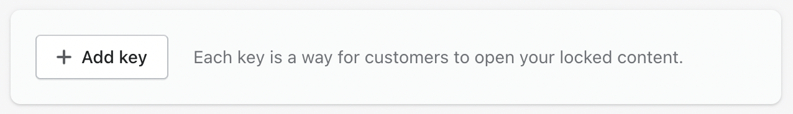

# Creating keys

Once you [create a lock](creating-locks.md), you'll need to create _keys_ – simple statements that describe the conditions for access. For example, one might have a key that says "Permit if the customer is signed in". In this example, the _key condition_ is "if the customer is signed in".

Keys are added inside the "Keys" section on the lock page. Click "+ Add key" to see the full list of available key conditions.

<figure><figcaption></figcaption></figure>

Locksmith offers a wide range of key conditions, grouped below by type to help you find the right one.

## **Permit if...**

#### _The customer..._

These conditions require the visitor to be logged into a customer account. If they aren't already signed in, they'll be prompted to do so before access is granted.

* **is signed in** — grants access to any visitor with a customer account, once logged in.
* **is tagged with...** — grants access if the customer's account carries a specific tag. If your store's login form includes a registration link, that will be shown too.
* **has one of many email addresses** — grants access if the customer's email address matches one from a list you specify.
* **has an email address from an input list** — works the same way, but draws from an input list that has been synced with Locksmith. (For more on this, see [Input Lists](../tutorials/more/input-lists.md).)
* **email contains...** — grants access if the customer's email address contains specific text you define — for example, "@mycompany.com".
* **has purchased...** — grants access if the customer's last 50 orders include a specific product, identified by SKU, title, or product tag.
* **has placed at least x orders** — grants access if the customer's lifetime order count meets a minimum number you set.

#### _The visitor..._&#x20;

These conditions do not require a customer account, and apply to anyone visiting your store.

**Passcodes**

Locksmith supports three passcode conditions, covering single, multiple, and bulk use cases:

* **gives the passcode...** — prompts the visitor to enter a passcode matching the one you configure. If the passcode is incorrect, they'll be prompted again.
* **gives one of many passcodes...** — grants access if the visitor provides any passcode from a list you configure.
* **gives a passcode from an input list...** — works the same way, but draws passcodes from an input list, making it suitable for bulk use. ([Input Lists](../tutorials/more/input-lists.md))

**Secret links**

Locksmith supports two secret link conditions:

* **arrives via a secret link...** — generates a secret URL for the locked resource. Visitors arriving via that link are granted access; visitors using any other link will be denied.
* **arrives using a secret link code from an input list...** — works the same way, but draws secret codes from an input list, making it suitable for bulk use. ([Input Lists](../tutorials/more/input-lists.md))

**Cart contents**

* **has a certain product in their cart** — grants access if a specific product is present in the visitor's current cart.
* **has a certain variant in their cart** — grants access if a specific product variant is present in the visitor's current cart.
* **has at least $x in their cart** — grants access if the subtotal of the visitor's current cart meets a minimum amount you set.

**Email subscriptions**

* **subscribes to your Mailchimp list** — connects to your Mailchimp account and grants access once a visitor provides their email address, adding it to your list.
* **subscribes to your Klaviyo list** — connects to your Klaviyo account and grants access once a visitor provides their email address.&#x20;
* **if the customer is a member of a Klaviyo list or segment** — grants access only if the email address is _already_ on the list.&#x20;

**Other visitor conditions**

* **has a certain IP address** — grants access if the visitor's IP address matches an address or range you specify.
* **is visiting from a certain location (city, country, etc.)** — uses the visitor's IP address to estimate their location via [GeoIP by MaxMind](https://www.maxmind.com/en/geoip2-services-and-databases) , granting access if it matches a location you define.
* **confirms the prompt** — grants access based solely on the visitor confirming a prompt that you configure.
* **is visiting a certain domain** — grants access if the visitor's domain matches a specific domain on your store. This is useful if your store has multiple domains scoped to different regions or audiences.

#### _Based on time_

* **is visiting before a certain date and time** — grants access if the current time is before a date and time you specify.
* **is visiting after a certain date and time** — grants access if the current time is after a date and time you specify.
* **if it's during a weekly schedule** — configure different schedules for each day with multiple time periods.

#### _Special conditions_

* **(always permit)** — forces a lock open, regardless of other conditions. This is most commonly used when you need to exclude certain content from another lock. For more detail, see: [Excluding Content from Locks](https://www.locksmith.guide/keys/more/excluding-content-from-locks) .
* **(custom Liquid)** — allows you to write custom Liquid code that grants access when your condition evaluates to true. This is the most flexible key condition available, and is useful when no standard condition fits your needs. For more detail, see our guide on custom [Liquid Keys](https://www.locksmith.guide/keys/more/custom-liquid-key-condition-basics).

## Copying keys between locks

If you need to reuse a key setup across multiple locks, Locksmith includes a copy and paste feature for keys.

**Here’s how it works:**

1. **Find the key you want to copy.** On any existing lock, locate the key you'd like to reuse and click the copy icon to the right of the key name.

<figure><figcaption></figcaption></figure>

2. **Navigate to your new lock.** Open the lock where you'd like to apply that key.
3. **Paste the key.** Click the paste icon beside "Add key." Locksmith will automatically add the copied key to your new lock.

<figure><figcaption></figcaption></figure>

You can repeat this as many times as needed to reuse key configurations across multiple locks.


**Note:** If your keys include product- or time-specific conditions, be sure to update those details after pasting.


***

## Related articles

More information on how to **combine key conditions together** is covered in our "Overview" guide here:


[combining-key-conditions.md](../keys/more/combining-key-conditions.md)


Remember that all key conditions can be **inverted!**


[inverting-conditions-in-locksmith.md](../keys/more/inverting-conditions-in-locksmith.md)


Having issues with **locks overlapping**? Perhaps the "Force open other locks" setting is for you:


[using-the-force-open-other-locks-setting.md](../keys/more/using-the-force-open-other-locks-setting.md)


More information on customer account keys:


[customer-account-keys.md](../keys/customer-account-keys.md)

