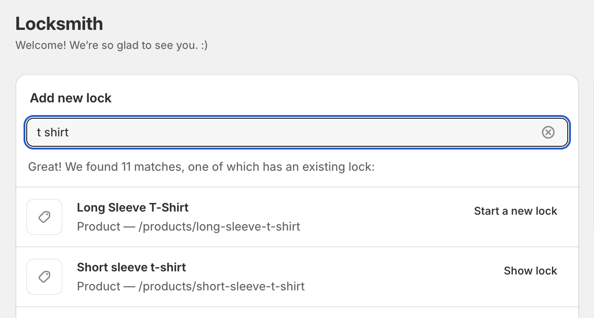

# Creating locks

Locks are how Locksmith controls access to content in your store. To create a lock, simply search for the resource you want to protect, select it, and then configure your access conditions (keys). This guide walks you through everything you need to know to get started.

### **What Is Searchable**

Use the search bar within Locksmith to find and lock any of the following resource types:

* **Products**
* **Collections**
* **Pages** — more info on Shopify pages here: [Pages](https://help.shopify.com/en/manual/online-store/os/pages)
* **Variants** — more info on Shopify product variants here: [Variants](https://help.shopify.com/en/manual/products/variants)
* **Blogs** — more info on Shopify blogs here: [Blogs](https://help.shopify.com/en/manual/online-store/os/blogs)
* **Blog posts** (also called articles) — articles must be tagged first; the tag is then searchable. More info on blog posts here: [Articles](https://help.shopify.com/en/manual/online-store/os/blogs/writing-blogs)
* **Product vendors**

To search, type the name of your resource into the search bar. Use specific terms. For example, "Long Sleeved T-shirt" rather than a broad term like "shirt".

### What is not searchable

The following cannot be directly locked via search:

* **Product tags** — to lock products that share a tag, create an Automated Collection and lock that instead.
* **Third-party app pages —** sometimes, a liquid lock can handle this, using the canonical\_url object.
* **Any page outside of your Online Store**
* **Menus and menu links** — menu links aren't directly lockable, but links pointing to lockable resources (such as products or collections) can be hidden from unauthorized visitors. To enable this, turn on the "Hide any links to this \[resource] in your shop's navigation menus" option under the lock's Settings.

### Specifying a resource type when searching

If a search returns too many results, or returns an error, you can narrow things down by specifying the resource type using this syntax:

* `product:snowboard`
* `collection:snowboards`
* `page:about snowboards`
* `blog:life is snowboarding`


**Hint**: If you're searching for a resource, but not getting the result you're looking for, try updating Locksmith to re-sync. Head over to the Help page in the app, and click the Update Locksmith button.


### Locking your entire store

Click into the search bar and select "Entire store" from the dropdown.

#### Excluding resources form the store lock

The store lock's settings page includes options to keep certain areas accessible to everyone:

* Allow access to the home page
* Allow access to policy pages
* Allow access to customer areas

For anything not covered by those options, see our guide on excluding content from locks:


[excluding-content-from-locks.md](../keys/more/excluding-content-from-locks.md)


### Locking all products in your store

By default, Shopify stores feature an 'All' collection that automatically encompasses all products in the store. Locking this collection offers an efficient method to secure all products in your Shopify store simultaneously, without the need to lock the entire store.

This collection can be locked just like any other collection. Search for the collection title 'all', select 'Collection: All' from the list of results, and follow the steps to create your lock.

<figure><figcaption></figcaption></figure>

### A note about Liquid locks

For resources that aren't searchable through the standard search bar, Locksmith offers "Liquid locks" — a more flexible option that lets you target nonstandard resources or custom groups of pages.

To start a Liquid lock, click into the search bar and select "Start a Liquid Lock".

<figure><figcaption></figcaption></figure>

For more detail, see our guide on Liquid locking basics:


[liquid-locking-basics.md](../tutorials/more/liquid-locking-basics.md)


### Troubleshooting

_My resource isn't showing up in search_

If something isn't appearing in search results, try the following:

* Use fewer, more specific search terms.
* Search by name rather than pasting in a URL — URLs won't work in most cases.
* For variants, include the variant option in your search. For example: "Color" equals "blue".
* If you've recently created the resource, it may not yet be indexed — try updating Locksmith (see below).

_Updating Locksmith_

Updating Locksmith refreshes its index of your store's resources, which can resolve search issues.

1. Open the Locksmith app and navigate to the "Help" page.
2. Click on the "Update Locksmith" button. \[screenshot]
3.

    <figure><figcaption></figcaption></figure>
4. When the blue bar at the bottom of the screen disappears, the update is complete. This should only take a few seconds.

\
As always, if you have questions or issues **please feel free to get in touch with us** at team@uselocksmith.com.
