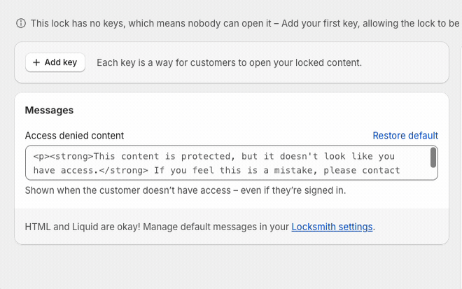

# A Locksmith Overview

Locksmith is a simple yet powerful tool to help you make sure the right people see the right things in your Shopify store. In the spirit of the name of our app - ✨ Locksmith ✨ - you'll be using "locks" to determine what content in your store is restricted and using "keys" to denote how, when, and who gets access.

### Locks

Locks are created using the search bar within our Locksmith app. You can search for most resources in your store by name. More in-depth information on the in-app search bar here:

[Creating locks →](https://www.locksmith.guide/basics/creating-locks)

A **lock** restricts access to something on your shop. You can lock:

* Your entire shop
* Pages
* Products
* Collections
* Prices  [more information here](https://www.locksmith.guide/tutorials/hiding-prices)
* The shopping cart (useful for preventing checkout until a condition is met)
* The login page
* The registration page (type 'register' into the Locksmith search bar)
* Product variants

For more advanced use cases, you can also create **custom Liquid locks** — these let you lock content based on any condition you can express in Liquid. Create one by clicking the _Start a Liquid Lock_ link above the Locksmith search bar.

#### Lock options

After selecting a resource and clicking Save, you'll see a set of options for that lock. The most commonly used ones are:

* **Is the lock currently active?**  Toggle the lock on or off without deleting it.
* **Should it also protect the products in this collection?**  Disabling this means only the collection page itself will be locked, not the individual product pages within it.
* **Should it hide the collection, and its products, from search results and other lists?**
* **Should it hide links to this resource from navigation?**

You'll see different options depending on what type of resource you've locked. There are also additional options available under the **Advanced** section, including manual locking mode  [more on that here](https://www.locksmith.guide/keys/more/manual-mode).

### Keys

A **key** permits access to the locked resource based on your criteria. Keys are created on the lock page using the "+ Add key" button.

Keys allow you to specify the exact conditions that give your customers access to the locked resource. There are over 20 built-in key conditions to choose from. You can also create your own **custom Liquid keys** by choosing _custom Liquid_ from the keys menu.

<figure><figcaption></figcaption></figure>

More information on creating keys here:

[Creating keys →](https://www.locksmith.guide/basics/creating-keys)

#### Combining conditions: OR versus AND

Locksmith gives you the flexibility to add multiple keys and logically combine them to create unique access scenarios.

**OR** — Add another separate key to your lock by clicking _Add Another Key_. Keys connected by OR can individually open your lock, regardless of whether the other keys' conditions are met. A customer only needs to satisfy one condition to gain access.

You can tell you're looking at OR keys because there are **multiple key symbols**, each preceded by "Permit if the customer..." text.

<figure><figcaption></figcaption></figure>

**AND** — Add another condition to the _same_ key by clicking _+ add key condition_ below an existing condition. When conditions are connected by AND, **all** of them must be met before access is granted.

You can tell you're looking at AND conditions because there is **only one key symbol**, with each condition inset beneath it.

<figure><figcaption></figcaption></figure>

[Combining key conditions →](https://www.locksmith.guide/keys/more/combining-key-conditions)

#### Inverting keys

All key conditions can be inverted — meaning Locksmith will check for the _opposite_ of the original condition. To invert a key, click the "invert" box in the upper right of the key.

For example, using inversion on a location key gives you: _Permit if the customer is **not** visiting from the United States._

[Inverting conditions in Locksmith →](https://www.locksmith.guide/keys/more/inverting-conditions-in-locksmith)

### Other useful settings

#### The "force open other locks" setting

If you have several locks covering overlapping content (e.g. locked collections that share some of the same products), you may want to enable the **"force open other locks"** setting on a key. This tells Locksmith to grant access to all content covered by the current lock, even if other locks might otherwise apply.

[Using the "Force open other locks" setting →](https://www.locksmith.guide/keys/more/using-the-force-open-other-locks-setting)

#### Cart and checkout validation

Locksmith also has a checkout validation feature, which lets you create a rule ensuring that products with a specific product tag can only be purchased by customers with a specific customer tag — without modifying the checkout UI itself.

[Setting up checkout validation with Locksmith →](https://www.locksmith.guide/tutorials/more/setting-up-checkout-validation-with-locksmith)

***

### Questions?

Feel free to reach out at any time. You can contact us via email at [**team@uselocksmith.com**](mailto:team@uselocksmith.com).
