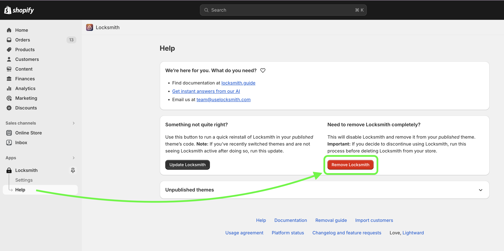

# Removing Locksmith

If you've been using Locksmith to protect your shop, uninstallation means two things:

1. Removing Locksmith from your theme
2. Removing Locksmith from your Shopify apps list

The order is important! **Locksmith is NOT able to clean up its code from your theme after you remove it from your apps list** (and neither can Locksmith staff), so it's critical to have Locksmith remove itself from your theme before removing the app from your list.


**Please note -** Before proceeding, please consider whether or not there has been any Locksmith code added to your theme manually in the past. This can happen if you are doing price hiding with Locksmith, or if you wrote in for support help and your theme needed to be adjusted. Any Locksmith code that was added manually to your theme needs to be manually removed from your theme!  If this is you, **do not follow the rest of this guide** - simply disable Locksmith from the "Settings" tab in the app, for now. This will cause Locksmith to be dormant in your store. Then, contact us at [team@uselocksmith.com ](mailto:team@uselocksmith.com)for help removing the code.&#x20;

_Do not delete the app from your apps list before getting the code removed - deleting the app while the code is still in your theme can cause your pages to be inaccessible!_


## 1. Removing Locksmith from your theme


**Important**: If you've already deleted Locksmith from your apps list, you'll need to temporarily add the app back to your store and accept the permissions, which will give Locksmith the ability to edit your theme to remove its code. You can add the app back to your store from [our app store listing](https://apps.shopify.com/locksmith).&#x20;

_You do **not** need to start a subscription to run Locksmith's code removal process._


1. To start, open the Locksmith app from within Shopify.&#x20;
2. Click on the "Help" link under "Locksmith" from the Shopify admin navigation menu.
3. Click the red "Remove Locksmith" button.

<figure><figcaption></figcaption></figure>

After clicking this, you'll see a status bar at the bottom of the screen, which is Locksmith letting you know that it's syncing your settings with Shopify. **When this status bar goes away, the removal has completed** - it should only take a handful of seconds. Wait for this to complete before continuing.

## 2. Removing Locksmith from your Shopify apps list

Delete Locksmith from your apps list in the standard way. Namely, from your Shopify admin, go to Apps > App and Sales Channel Settings > Locksmith > Delete.

[More information from Shopify about deleting apps here](https://help.shopify.com/en/manual/apps/working-with-apps#uninstall-an-app).


**Note**: Deleting the Locksmith app from your apps list will automatically cancel your subscription, so at this point, no further action is necessary.


### Cancelling your Locksmith subscription

**Important:** If you have decided to NOT delete the Locksmith app from your apps lists, as outlined above, please make sure to cancel your subscription manually, to avoid being charged unexpectedly:

<figure><figcaption></figcaption></figure>
