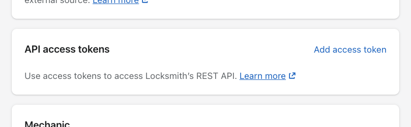

# Locksmith Admin API

Locksmith's Admin API can be used to query Locksmith to get information about your locks, keys, and settings. As a REST API, it closely resembles [Shopify's own REST Admin API](https://shopify.dev/docs/api/admin-rest).


Locksmith's Admin API is not intended for use in themes or user-facing browser experiences. For that, use Locksmith's [Storefront API](locksmith-storefront-api.md). Any client-side browser Javascript calling the Admin API will encounter [CORS](https://developer.mozilla.org/en-US/docs/Web/HTTP/Guides/CORS) errors.


### Versions

We maintain a 1-to-1 relationship with Shopify's API versions. Any [current and valid Shopify API versions](https://app.shopify.com/services/apis.json) are also current and valid Locksmith versions.

Read more about [Shopify's versioning philosophy](https://shopify.dev/docs/api/usage/versioning).


For simplicity, the use of `unstable` as the version when calling this API will work for most use-cases.


### Authentication

There are two required headers:

| Header                     | Description                                                            |
| -------------------------- | ---------------------------------------------------------------------- |
| `x-shopify-shop-domain`    | Must be of the format "example.myshopify.com"                          |
| `x-locksmith-access-token` | Must be an enabled access token, generated in your Locksmith settings. |

Using cURL, one might access the API this way:

```
curl \
   --header "x-shopify-shop-domain: example.myshopify.com" \
   --header "x-locksmith-access-token: xxxxxxxxxxxxxxxxxxxxxxxxxxxxxxxx" \
   https://uselocksmith.com/api/unstable/shop.json
```

## Endpoints

All requests should be prefixed with **https://uselocksmith.com/api/:version**

#### Input lists

* <mark style="color:green;">`POST`</mark> `/input-lists/:id/sync` \
  Requests an input list sync for the input list indicated by the ID

#### Installs

* <mark style="color:green;">`POST`</mark> `/install` \
  Requests a full Locksmith installation to the _currently published_ theme

#### Locks

* <mark style="color:purple;">`GET`</mark> `/locks.json` \
  Returns an array of all locks in your Locksmith account
* <mark style="color:purple;">`GET`</mark> `/locks/:id.json` \
  Returns data for a single lock in your Locksmith account

#### Shop

* <mark style="color:purple;">`GET`</mark> `/shop.json` \
  Returns Locksmith's entire configuration for your store

### Conventions

* Do not rely upon data keys that are prefixed with an underscore (e.g. "\_foobar"). They are subject to change or removal at any time.

### Generating an access token

To access this API, generate an access token. You can find these toward the end of your settings area:



Use the "Add access token" link to add your first token.

Once created, an access token may be edited to enable/disable it, or to change its name. It may also be deleted.\
