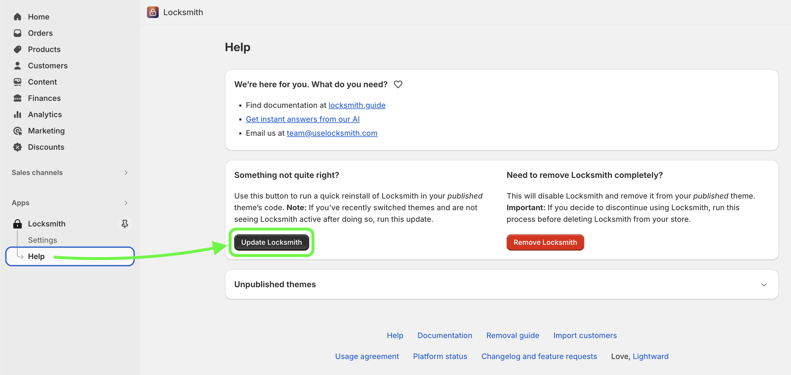

# I switched themes, and Locksmith isn't working

## **The solution: trigger a new Locksmith install for your theme**

**Click the "Help" button, and then click the "Update Locksmith" button:**

When changing around themes, Locksmith needs to be re-installed each time you do this. To initiate a new theme install on your _currently published theme_, press the "Update Locksmith" button on the "Help" page:

This will trigger a full reinstall of Locksmith's code into your theme - this is important, because Locksmith is able to do what it does via Liquid code in your shop's theme.

## **Using manual locking?**


**This is important!** If you are using Locksmith for price hiding or other types of manual locking, _or any other type of Locksmith code manually added to your theme by a developer or our team,_ you'll need to re-instate the code changes in your new theme.


If this is the case, contact us via email at **team@uselocksmith.com,** and we'll be happy to add the manual code to your new theme for you.
