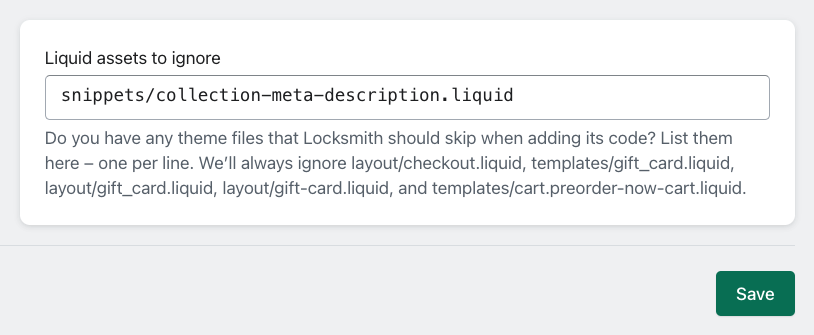

# Locksmith isn't installing correctly!

On very rare occasions, Locksmith runs into an issue processing a particular asset in your theme, and can't perfectly complete the installation. If this is happening, Locksmith will let you know within the app, like this:

## If you're confident you don't need Locksmith's code in that asset...

... you can add the asset key to your shop's list of Liquid assets to ignore. You can find this in the "Settings" page of your Locksmith app in the "Advanced" section, and it looks like this:

Add whatever asset keys you like, making sure to include both the portion before the slash, and the ".liquid" at the end.

## If you're seeing "Asset Template content exceeds 256 KB limit"...

... you may have too many locks and/or keys. We work hard to keep Locksmith trim and efficient, but it _is_ possible to exhaust Shopify's size limit for the assets Locksmith uses.

To solve this, remove what locks and keys you can. If you don't see a good way to do so, get in touch – we're happy to help you set up a configuration strategy that covers your bases while staying under the size limit.

## If you're not sure if the problem assets are important or not...

... let us know. Email us at team@uselocksmith.com, and we'll help. :) These kinds of things tend to be very, _very_ theme-specific, and the best way we can help you is by rolling up our sleeves and going under the hood on your behalf.
