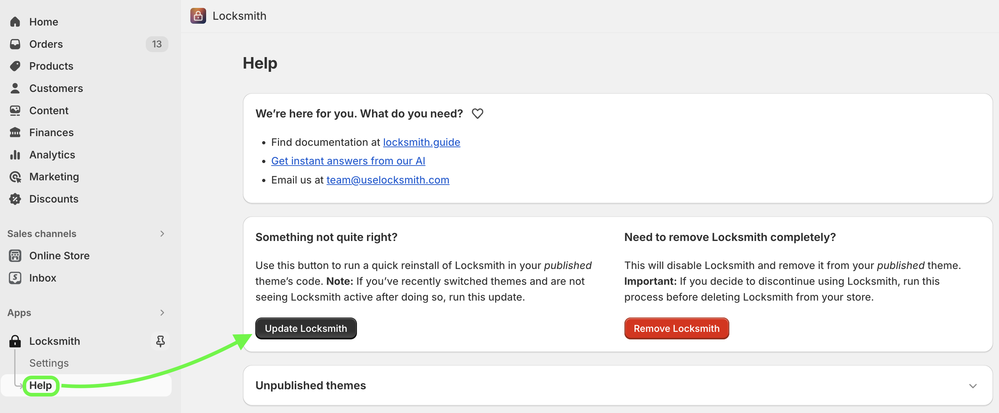

# Why aren't my locks working?

## First thing to try: Update Locksmith

Is your Locksmith installation synced up with your current theme? When changing around themes, Locksmith needs to be re-installed each time you do this. To initiate a new theme install on your _currently published theme_, press the "Update Locksmith" button on the "Help" page:

## Using passcodes, secret links, newsletter, or location keys?

Read our full guide on this here:


[why-isnt-my-remote-key-condition-working.md](more/why-isnt-my-remote-key-condition-working.md)


If you've been testing out your locks, and you've already entered the passcode or used the secret link, etc, during the current browser session, the content is now unlocked for you, and will be accessible on your current browser: Locksmith will not continue to ask you for access credentials.

To test out what a new visitor to your website will see, use an incognito window, or try on a different device or browser.

For more information from the sources on **how to use an incognito window** in each of the different types of browsers(sometimes called "private session"), use the following links:

* [Chrome](https://support.google.com/chrome/answer/95464)
* [Safari on Mac](https://support.apple.com/guide/safari/browse-in-private-ibrw1069/mac)
* [Safari on iOS](https://support.apple.com/en-us/HT203036)
* [Firefox](https://support.mozilla.org/en-US/kb/private-browsing-use-firefox-without-history)
* [Edge](https://support.microsoft.com/en-us/help/4026200/microsoft-edge-browse-inprivate)

## Lastly...

If none of the above helps, inside the Locksmith app, double-check each lock individually for warnings. Or, for any extra keys that might be accidentally allowing access.

If you're still having trouble, email us – [team@uselocksmith.com](mailto:mailto:team@uselocksmith.com). We're here to help. :)
