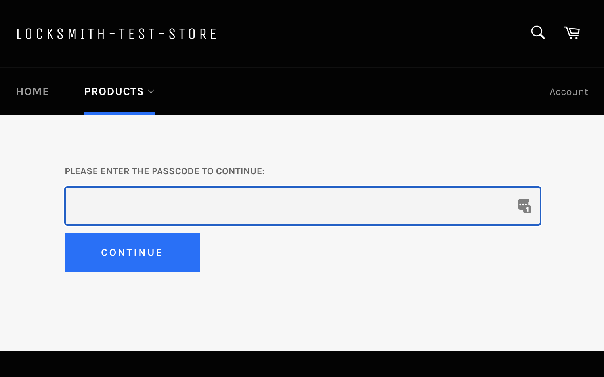

# Passcode keys

Passcode keys are a simple way to grant access to content **without** needing to require sign in or registration. They work completely independent of the Shopify customer account system.&#x20;

After you use the Locksmith search bar to create a lock on the product or collection that you want to lock, choose one of the passcode conditions from the conditions list under "Keys":

<figure><figcaption><p>Typing in "passcode" into the input will filter the list to only show passcode key condition types.</p></figcaption></figure>

**Single passcode**: Use when only one passcode is needed.

**Many passcodes**: Allows you to enter many passcodes at one. Enter your passcodes one per line. This is a quick way to set up multiple passcodes at once. However, the input-list is more performant with large quantities(more than a thousand or so), _particularly if using single-use passcodes,_ so in these cases, it is recommended that you default to an input list.

**Input list**: Allows you to add your passcodes to a google sheet or other file that is stored online outside of Locksmith. Capacity for many hundreds of thousands of passcodes. [More information on input lists here](../tutorials/more/input-lists.md). When setting up an input list, you can specify a usage limit that will apply to all passcodes inside the input list.

Once the key is created, and the lock is saved, your customers will now be prompted to enter the passcode when they visit the locked page:




### Important info about testing passcode keys

When you give the correct passcode at the passcode prompt form, Locksmith will remember you by saving a session cookie in your browser. That means that when you come back to view the shop, you'll likely still have access, making it seem like the lock isn't working.&#x20;

So, when testing passcode keys, _be sure to use a new_ [_private browser window_](../tutorials/more/how-to-use-a-private-browsing-session.md) _each time_. That shows you what a new visitor will see.


### General Passcode Key Notes

* Passcode keys allow you to require a password for access without requiring the customer to log into an account. They are completely separate from the customer account system.
* Passcode keys will increase loading time just a bit, on the first page load.
* The passcode key is what we call a "remote key" which saves info in your cart attributes. That info gets passed through as a note on your orders. You can remove that following [the steps here](../faqs/more/why-is-locksmith-adding-information-to-my-orders.md).
* Passcode entry is applied across your entire store, so if you set multiple locks with the same passcode, entering the passcode at any of those locked pages will also allow the customer to access the other locked resources--all without requiring another passcode entry. This also works to reveal navigation links pointing to those locked resources, when the "hide links" option is enabled on a lock.&#x20;

####

### Passcode key options

**Passcode uses left**

Found in the single passcode key. Use this option only if you want the passcode to have a usage limit. The number will decrease by one each time the passcode is entered. When the number hits zero, the passcode will no longer work.

**Remember for signed in customers**

This option will remember a customer who was signed in when they entered the passcode, and never ask them again when they're signed in.

**Customer auto tag**&#x20;

If the customer is logged into their account when they give the passcode, they'll get tagged with the tag you enter here.

**Allow only one use per passcode**&#x20;

Found in the "many passcodes" key only. When the customer gives a passcode from the list, it gets removed from the list and can't be used again (unless you re-add it). **Note:** If you want to add a usage limit to a passcode-from-input-list key condition, that is done on the input list itself. [More information on input lists here](../tutorials/more/input-lists.md).

### Passcodes and manual locking

Passcode keys are compatible with manual locking! This means that you can hide only selected parts of the page, instead of the whole page. For example, [when hiding prices](../tutorials/hiding-prices.md).

If you have a manual passcode lock set up, the customer will not get prompted for a passcode automatically. So in this case it's necessary to add a button to trigger the passcode prompt. Use the following code to add a button to your page:

```
<a href="" class="btn button locksmith-manual-trigger">Enter passcode to access</a><br>
```

The classes may need editing to match your theme.

When the customer clicks that button, they'll be presented with the passcode prompt as normal. If they enter the correct passcode and submit, the page will reload but this time showing your locked content.&#x20;


Passcode keys are _**not**_ compatible with variant locks by default. Please see:&#x20;



## Related articles


[customizing-messages.md](../tutorials/more/customizing-messages.md)



[customizing-the-passcode-form.md](../tutorials/more/customizing-the-passcode-form.md)



[why-isnt-my-remote-key-condition-working.md](../faqs/more/why-isnt-my-remote-key-condition-working.md)

