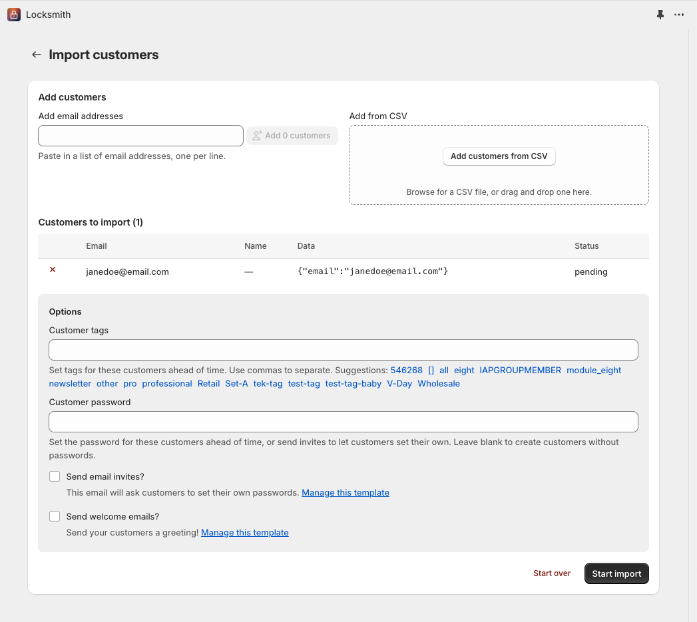

# Approving customer registrations

You can use Locksmith to only grant access to your content to **registered customers that you approve**.


**Note**: Locksmith does not create a separate account system or customer database, you'll be using the default customer accounts feature that comes with all Shopify stores. Before using this guide, you'll want to make sure that accounts are enabled on your Shopify store. [Learn more about customer accounts in Shopify.](https://help.shopify.com/en/manual/customers/customer-accounts)


## Step 1: Creating the lock

To get started with this, you'll want to first create the lock that covers the content that you want to restrict. Since Locksmith gives you flexibility to decide what content you want to lock, you can apply this restriction to your entire store, or just to specific pages or collections in your store. Our full guide on locks contains all the information you need to create your lock, including how to create a lock to cover your entire store:


[creating-locks.md](../basics/creating-locks.md)


If you are choosing a more granular approach, you will need to create multiple locks that span the different products, collections, and pages that you want to lock.

## Step 2: Creating the key

Once the lock is created, you'll want to create the key next. When setting up an approval process, the simplest way to do it is to use the key condition labelled "**Permit if customer is tagged with...**". This means that only accounts that have the specific tag can gain access to the locked content. That will look like this:

<figure><figcaption></figcaption></figure>


**Note**: You can use whatever tag you prefer here! Using **approved** here is just an example, but will be referred to in the rest of the guide.


Using customer tags to grant access is the easiest way to approve accounts. However, you can technically use any customer data to grant access. More information on that here:


[customer-account-keys.md](../keys/customer-account-keys.md)


## Step 3: Choosing how customer accounts are created

The above two steps outline how you use Locksmith to approve customer access to content. However, it's also important is to decide how the customer accounts are created to begin with.

You have some options:

1. Allow customers to create the accounts on their own
2. Create pre-approved customer accounts, and send email invitations.

### Option 1: Allow customers to register their own accounts, then approve as appropriate.

This would be considered the default way, and doesn't require any extra steps. Customers will simply register their accounts as normal, using your default registration form, and you can choose the ones you want to "let through" to your locked content. You'll simply [use Shopify's "Customers" area ](https://help.shopify.com/en/manual/customers/manage-customers#edit-a-customers-tags)to tag the customers appropriately.

#### If you need email alerts when customers sign up...

Shopify does NOT send registration notifications. If this is important to you try [this customer email alert task from Mechanic](https://tasks.mechanic.dev/customer-signup-email).

#### If you need to collect additional information from customers in your registration form...


[customizing-the-registration-form.md](more/customizing-the-registration-form.md)


### Option 2: Create pre-approved customer accounts, and send email invitations.

If you already have the email addresses of those to whom you'd like to grant access, you can use Locksmith's customer import/creation tool to create their accounts. The customer import tool allows you to pre-tag any customer accounts that you create this way, so they'll automatically be granted access once they begin using your site.&#x20;

A complete guide on the importing tools is here:


[importing-customers-in-bulk.md](more/importing-customers-in-bulk.md)


Beyond entering the customers' email addresses, make sure to use the "Customer tags" field and enter "**approved**" as the tag, so that all of the customers imported this way are tagged. There are also some other options worth taking a look at:

<figure><figcaption></figcaption></figure>

#### Optional: Lock the registration page

If you are using [**Legacy Customer Accounts**](https://help.shopify.com/en/manual/customers/customer-accounts)**,** you also have the ability to place a lock on the registration form directly, so that customers cannot register their own accounts.


[locking-the-customer-registration-form.md](more/locking-the-customer-registration-form.md)

