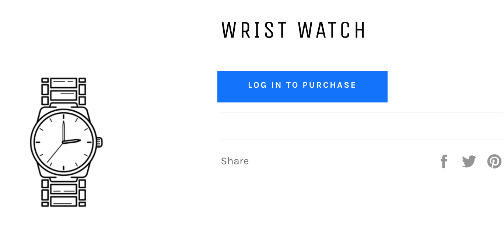
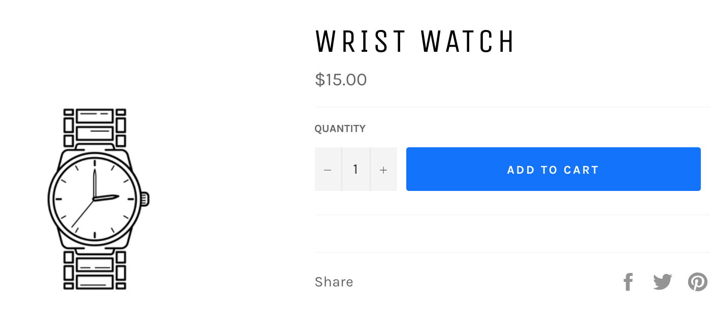
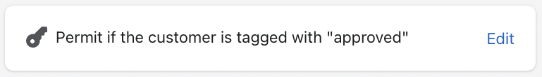
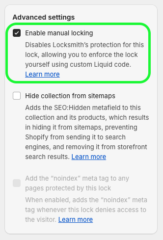

# Hiding product prices and/or the add to cart button

Locksmith's [manual mode](more/manual-mode.md) feature can be used to hide your product prices so that customers can still browse your shop, but can only see prices and purchase products if certain conditions are met.

Here is an example of a product page that has been setup properly with Locksmith to hide prices:



Then, when the customer meets the conditions, the product pages will appear normally:




**Note:** The results may look different depending on your Locksmith conditions, theme, or other settings.



**Also note**: While this method does hide the price visually, it may still be possible for someone viewing the source (or interacting with the browser console) to see the price. This is because of the presence of things like Google Analytics and other tools, which reproduce the price in the source - but not visually on the page - for their own usage. These are out of control of the Locksmith app.


You can also setup Locksmith to hide from collection pages and searches (as long as the default Shopify search is used).

You have flexibility! For example, you can require accounts to be approved in addition to signed in. Our whole library of key conditions is at your disposal here. You can also set it up on only some of your products if you want to leave some products available. Or, you can simply hide the add-to-cart button and leave the product prices visible.

Use the following two steps to set it all up:

## 1. Create lock

The first step to hiding your prices using Locksmith is to create a lock that covers the products that you would like to hide prices on. To do this, open up Locksmith and use the search bar on the main page of the app. If this is all of your products (most common), you can simply search for "all" and choose the "All Products" collection:



**Warning**: make sure to choose "Collection: All" and **not** "Collections Listing"


If you are only wanting to apply pricing hiding to some of your products, you can instead create a lock on different collection(s) or products that you want prices hidden for

Once you've created the lock, you'll choose the conditions for access. Many merchants use the "Permit if customer is tagged with..." key condition, which lets you manually approve accounts for price access by adding a customer tag:

<figure><figcaption></figcaption></figure>

That's the most common way to set it up, but you have the freedom to choose whatever key conditions work for your setup.

Before saving, turn on "Enable manual mode" right there in the lock (Clicking "Advanced" will show the option):



Done with step one!

## 2. Updating your theme for manual locking

You'll now need to add the code to your theme to let Locksmith know which parts need to be hidden.

**Because each theme is a bit different, this feature&#x20;**_**does**_**&#x20;require manual coding.** If you install a new theme down the road, these changes will need to be re-applied.

The rest of this guide gets a bit technical, we'll happily to the coding portion for you! If you've already created the lock described in step 1, simply write us a message at **team@uselocksmith.com** to request help.


**Note:** Locksmith's manual locking feature generally can _**not**_ hide elements or sections that are being managed or displayed by other third-party apps, including page builder apps.&#x20;


If you are a developer type, and prefer to do the coding portion yourself, read on...\
\
You'll need to start by locating the places in your theme that show the price. Here are some examples of files that you might find the price in:

* snippets/product-card-grid.liquid
* templates/product.liquid
* snippets/product-card-list.liquid
* snippets/product-price.liquid

Each theme is very different, so those are simply examples. You'll need to go to each of the files that display price, and do the following steps:

1.  Open up the Liquid file, and add this to the very top of the file:

    ```
    
    
    
    ```
2.  Find the code you want to hide from unauthorized viewers, and wrap it with:

    ```
    
    ...
    
    ```
3.  To hide prices, you'll be looking for elements like:

    ```
    {{ product.price }}
    ```

    ... or:

    ```
    {{ item.price }}
    ```

    **Example:**

    

    This shows Locksmith manual locking code wrapping an entire price section, which I've highlighted.
4. Save!

Remember, those 4 steps need to be done for each file that display the price.


In many cases, the above code only needs to be added to two or three files. Whichever file is in charge of displaying the price on **product** pages, **collection** pages, and **searches**. The latter two are oftentimes the same.


### Configuring Locksmith to hide the add-to-cart button only <a href="#hide-add-to-cart" id="hide-add-to-cart"></a>

You can still restrict purchasing products, while leaving the product details visible to the customer. This also a good option for those wanting to make sure that products are **available for search engines to index**.

**As a reminder**, we can help guide you through this process, including adding the code, so don't hesitate to get in touch.&#x20;

Step 1 is exactly the same, but the code you add in step 2 will be slightly different.

Find the product-template or product-form file in your theme, and locate the code that generates the "add-to-cart" button. This is different for all themes, so it won't be possible to give you an exact location for this. Then, add the code that you want to render, inside of a Liquid "else" statement. For example:

```




  <button type="submit">
    Add to cart button example
  </button>

  <p><strong>Product not available</strong></p>


```

This results in the add-to-cart button being replaced, in cases where the customer doesn't have access. What is shown depends on what is added above. Just make sure your key conditions on the lock match the conditions that you want your customers to meet before being able to purchase.

#### For stores using Shopify's [legacy customer account system](https://help.shopify.com/en/manual/customers/customer-accounts/legacy-customer-accounts) (formerly "Classic customer accounts"):&#x20;

If you need to render a "Login to purchase" button, use the following code (the button classes may need to be edited). This button includes a redirect to return customers after login:

```
<a href="/account/login?return_url={{ request.path }}" class="btn button button button--full-width button--secondary">Log in to purchase</a>
```

#### For stores using Shopify's [customer account](https://help.shopify.com/en/manual/customers/customer-accounts/new-customer-accounts) system (formerly "New customer accounts":

If you need to render a "Login to purchase" button, use the following code (the button classes may need to be edited). This button will return customers after login:

```
<a href="/customer_authentication/login?locale={{ request.locale.iso_code }}&?return_url={{ request.path }}" class="btn button button button--full-width button--secondary">Log in to purchase</a>
```

#### For locks using passcode keys:

If you need to render a passcode prompt button, use the following code (the button classes may need to be edited):

```
<button class="locksmith-manual-trigger btn button">Enter passcode to purchase</button>
```

#### For locks using location keys:

You can add an access denied message of location keys by adding paragraph tags and some text within the Liquid "else" statement, for example:

```
<p><strong>Product not available in your country.</strong></p>
```

#### When using the "is tagged with..." key condition you can display a "Login to purchase" button _or_ an access denied message depending on a visitors access:

<details>

<summary>Click here for an example</summary>

The following example includes an "else" statement that will:

* display an access denied message to customers who _are_ signed in and _don't_ have access to the lock.&#x20;
* or a "Login to purchase" button for customers who aren't signed in.

<pre><code><strong>
</strong>  &#x3C;button type="submit">
    Add to cart button example
  &#x3C;/button>

  
    &#x3C;p style="font-weight: bold; padding-top:20px; padding-bottom:20px;">You do not have access to this resource.&#x3C;/p>
    
    &#x3C;a style="width: 100%;" href="/customer_identity/sso_hint" class="btn button" data-locksmith>Log in to purchase&#x3C;/a>
    

</code></pre>

**Note:** The above example uses a "Login to purchase" button for Shopify's [standard customer accounts](hiding-prices.md#for-stores-using-shopifys-customer-account-system-formerly-new-customer-accounts) system.

</details>

### Here are some visual examples of the result

#### Requiring, a sign-in:


#### **A passcode:**


#### **A country-specific visitor:**



Please note: since the custom liquid code is added manually to the store theme, anytime you switch to a _**new**_ or _**updated**_ theme the custom code has to be manually added again to the new theme. We're always happy to add code to new or updated themes if you write into [team@uselocksmith.com](../policies/contact.md)\
\
We recommend leaving the new theme _unpublished_ while you wait for the code to be added, so that nothing is exposed in the meantime. :)




If Locksmith's custom manual locking code is added to an _**unpublished**_ theme, please be sure to visit our guide below for instructions on testing:\
\
[testing-locksmith-on-unpublished-themes.md](more/testing-locksmith-on-unpublished-themes.md "mention")

