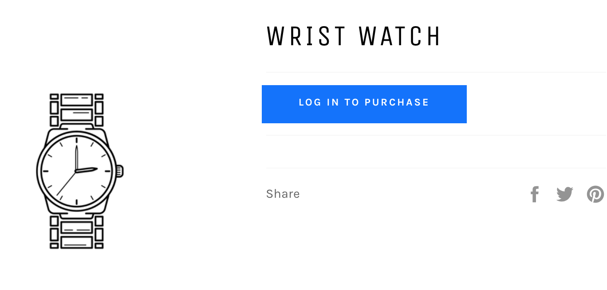
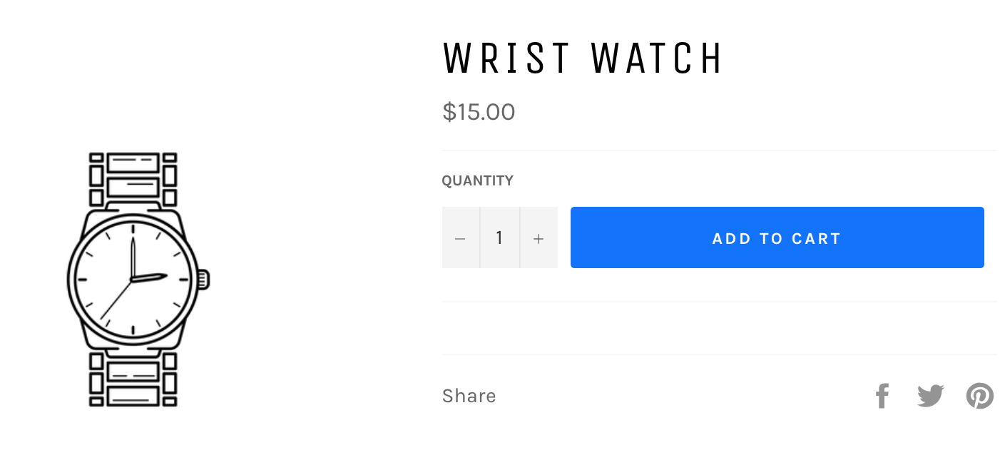

# Hiding product prices and/or the add to cart button

Locksmith can hide prices and buy buttons for locked products, so that customers can still browse your shop, but can only see prices and purchase products if certain conditions are met.

This is built into every lock's settings — no theme code required. Locksmith integrates directly with your theme's own price and buy-button code, so hiding follows the locked products wherever your theme displays them.

Here is an example of a product page that has been set up with Locksmith to hide prices:



Then, when the customer meets the conditions, the product pages will appear normally:




**Note:** The results may look different depending on your Locksmith conditions, theme, or other settings.


Use the following two steps to set it all up:

## 1. Create a lock

The first step is to create a lock that covers the products that you would like to hide prices on. To do this, open up Locksmith and use the search bar on the main page of the app. If this is all of your products (most common), you can simply search for "all" and choose the "All Products" collection:



**Warning**: make sure to choose "Collection: All" and **not** "Collections Listing"


If you are only wanting to apply price hiding to some of your products, you can instead create a lock on different collection(s) or products that you want prices hidden for.

Once you've created the lock, you'll choose the conditions for access. Many merchants use the "Permit if customer is tagged with..." key condition, which lets you manually approve accounts for price access by adding a customer tag:

<figure><figcaption></figcaption></figure>

That's the most common way to set it up, but you have the freedom to choose whatever key conditions work for your setup.

## 2. Turn on hiding

In the lock editor, find the **Price & add-to-cart hiding** card, just below your keys. It has two settings:

* **Hide buy buttons** — hides the add-to-cart button, dynamic checkout buttons (like "Buy it now"), and quantity selectors for the locked products. This is what keeps locked products out of the cart.
* **Hide price** — hides the locked products' prices.

When you turn either setting on, Locksmith scans your published theme to find the places where it can integrate, and shows you a compatibility result for each setting. Save your lock, and Locksmith updates your theme automatically — and re-checks your theme every time it installs from then on, so theme updates are picked up on their own.

Where the buy buttons were, your visitors will see your lock's message content instead (a "Log in to purchase" button, a passcode prompt, or whatever fits your key conditions) — styled to match your theme.

## What gets hidden

Wherever your theme renders the locked products through its own templates: the product page, collection and search grids, featured-product sections, and quick-view popups. Unlocked products are never affected — hiding follows the locked products individually.

## Good to know


**Hiding prices without hiding buy buttons?** Prices always appear in the cart and at checkout — Shopify doesn't provide a way to hide them there. If you're hiding prices, we recommend hiding buy buttons too, so locked products can't reach the cart in the first place. The app will remind you about this combination.



While Locksmith hides the price visually, it may still be possible for someone viewing the page source (or using the browser console) to find it. This is because of things like SEO markup and analytics tools, which reproduce the price in the source — but not visually on the page — for their own usage.



Prices displayed by **third-party apps** (page builders, currency converters, wishlist apps, and so on) render outside your theme's own code, so they aren't hidden automatically — but Locksmith support may still be able to help with these. Feel free to reach out.



If your theme already contains **hand-written Locksmith code** (from the manual methods below), the automatic settings may not work well alongside it — the app will show a warning if it detects this. Write to us if you'd like help transitioning.


## If your theme shows "Incompatible"

Every theme is different, and occasionally Locksmith won't find a spot it can safely integrate with. If that happens, the app will say so rather than guessing — and this is exactly the kind of thing our support team is here for. [Write to us](../policies/contact.md) and we'll work with you to get your theme set up.

## Advanced: adjusting what Locksmith found

The scan's results are visible — and editable — on your theme's hiding profile page (**Themes → your theme → hiding profile**). Each automatic definition can be adjusted (its Liquid variable, whether it shows your replacement message), removed, or restored, and there's a reset if you'd like to return to the theme defaults. Your edits survive re-scans.

## Manual alternatives

Before these built-in settings existed, price hiding was set up through [manual mode](more/manual-mode.md) — either with theme hiding profiles or with hand-written code. These methods still work, and remain useful for special cases:

### Theme hiding profiles

This method allows you to define sections, blocks, or snippets which Locksmith will hide based on locks that have the Manual Locking option enabled. Here's a complete guide:


Theme hiding profiles: Hide prices without coding.


### Manual locking code

Hand-written Locksmith code in your theme offers the most control, at the cost of needing to be re-applied whenever you switch themes. We'll happily do the coding portion for you — just write us at [team@uselocksmith.com](../policies/contact.md).

<details>

<summary>Click here for the technical details</summary>

You'll need to locate the places in your theme that show the price — for example files like `snippets/product-card-grid.liquid`, `templates/product.liquid`, or `snippets/product-price.liquid`. In each file:

1.  Add this to the very top of the file:

    
    ```liquid
    
    ```
    
2.  Wrap the code you want to hide with:

    ```liquid
    ...
    ```
3.  For prices, look for elements like `{{ product.price }}` or `{{ item.price }}`. For the add-to-cart button, find the product form and use an `else` branch to show replacement content:

    
    ```liquid
    
      <button type="submit">
        Add to cart button example
      </button>
    
      <p><strong>Product not available</strong></p>
    
    ```
    

For a "Log in to purchase" button in the `else` branch, on Shopify's [customer accounts](https://help.shopify.com/en/manual/customers/customer-accounts/new-customer-accounts) system:


```html
<a href="/customer_authentication/login?locale={{ request.locale.iso_code }}&return_to={{ request.path | url_encode }}" class="btn button button--full-width button--secondary">Log in to purchase</a>
```


... or on the [legacy customer account system](https://help.shopify.com/en/manual/customers/customer-accounts/legacy-customer-accounts):


```html
<a href="/account/login?return_url={{ request.path }}" class="btn button button button--full-width button--secondary">Log in to purchase</a>
```


For locks using passcode keys, a passcode prompt trigger:


```html
<button class="locksmith-manual-trigger btn button">Enter passcode to purchase</button>
```


</details>


Please note: since manual locking code is added by hand to the store theme, anytime you switch to a _**new**_ or _**updated**_ theme the custom code has to be added again. (The built-in settings at the top of this guide re-apply themselves automatically — one more reason to prefer them.) We're always happy to add code to new or updated themes if you write into [team@uselocksmith.com](../policies/contact.md)



If Locksmith is set up on an _**unpublished**_ theme, please be sure to visit our guide below for instructions on testing:\
\
[testing-locksmith-on-unpublished-themes.md](more/testing-locksmith-on-unpublished-themes.md "mention")

