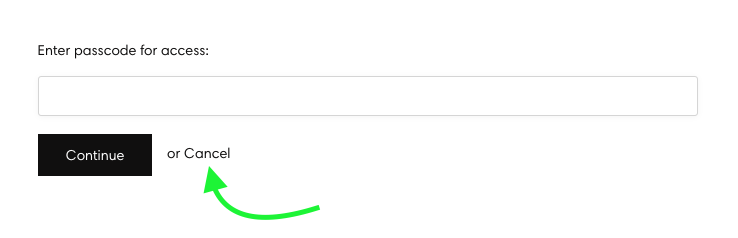

# Customizing the passcode form

Responsive background image for the passcode formResponsive background image for the passcode formResponsive background image for the passcode formHere are some of the many different ways you can edit the passcode form!

## Add content that is displayed before the form.

This is the default behavior for the message. You can add as much content as you need, including text, images and backgrounds, by simply adding code directly to the "Passcode prompt" area, found on the lock page, under Messages:


Any code that you add to this area will be rendered normally, as if adding it to the theme. Including:

* HTML - using regular HTML tags
* CSS - using \<style> _your CSS code here_ \</style>
* Javascript - using \<script> _your javascript code here_ \</script>
* Liquid - using [regular Liquid syntax](https://shopify.dev/api/liquid/basics)

## Add content _after_ the form

Simply use \{{ locksmith\_passcode\_form \}} to denote where the form itself will go, and then add in content that you want to display before and after it.

```
<p>Please enter the passcode to continue: </p>

{{ locksmith_passcode_form }}

<p> Content to be displayed after the form </p>
```

## Editing the "Continue" and "One moment..." text

This is not done in the Locksmith app, but rather in the theme's "Edit default theme content" settings:

<figure><figcaption></figcaption></figure>

Once in the "Theme content" settings, you'll need to go to the "Locksmith" tab, which is typically not visible right away:

<figure><figcaption></figcaption></figure>

So then finally, you can edit the text itself, under the Locksmith tab:

<figure><figcaption></figcaption></figure>


**Note**: This step only changes the wording for your default language. If you are using multiple languages in your store, you'll also need to go through the "Localize" step. Check out [Shopify's guide on doing that](https://help.shopify.com/en/manual/markets/languages/manage-languages) here.


<details>

<summary>Editing the "Cancel" button text used in the manually triggered passcode form</summary>

Locksmith's manual mode can be used to hide specific parts of your theme, such as the add-to-cart button, instead of hiding the entire product page. In this case, the passcode form needs to be 'manually triggered' to present the form to customers, using a custom passcode button.&#x20;

This is covered in our price hiding guide here: [Hiding product prices and/or the add to cart button](../hiding-prices.md)

The manually triggered passcode form includes a 'Cancel' button that can be used to close the passcode form, revealing the product page again.



To edit the text for this button, some CSS will need to be added to the 'Passcode prompt' message field. The following example code can be used for that, replacing the 'Close' text with your own.

```
<style>
    .or-cancel a:nth-child(1) {
        visibility: hidden;
        position: relative;
    }
    .or-cancel a:nth-child(1):after {
        content: "Close";
        visibility: visible;
        position: absolute;
        top: 0;
        left: 0;
        color:black
    }
</style>
```


</details>

## Including other form types

If you have multiple key condition types on the same lock, it might be useful to include other form types within the prompt, so that they display on the same page. We have a guide on doing this here:


[showing-multiple-prompts-on-the-same-page.md](showing-multiple-prompts-on-the-same-page.md)


Please note that this is NOT compatible with replacing/editing the form itself (as detailed in the next section).&#x20;

## Replacing or editing the form itself

Some merchants want more control over the form itself, not just the text that is shown alongside it. This could just be for more granular edits to the way it looks, or to perform more complicated javascript operations on the text input.

Although we can help troubleshoot, if you choose to override the form, the coding and style is up to you, we are not able to create a new form for you.

To do this, simply use the "Passcode prompt" area to put in your new form. Since you're overriding the form, you'll need to add in all the code for the new form. To begin, copy/paste this entire section (including the script!) into the Messages > Passcode prompt area. Then, edit as needed:

```
<div class="locksmith-passcode-container container page-width">
  <form id="locksmith_passcode_form">
    <p>Enter the passcode to continue: </p>
    <p><input autofocus id="locksmith_passcode" class="locksmith-passcode 
failed
"></p>
    <p><button type="submit" class="button button-primary btn btn-primary action-button action_button">CONTINUE</button></p>
  </form>
</div>

<script>
  var passcodeForm = document.getElementById("locksmith_passcode_form");
  passcodeForm.addEventListener('submit', function (event) {
    event.preventDefault();
    var passcode = document.getElementById("locksmith_passcode").value;
    /* REMOVE THIS LINE and insert any desired transforms to passcode here */
    Locksmith.submitPasscode(passcode, event);
  });
</script>
```

&#x20;If you need to perform text transforms (e.g. downcasing the text for case-insensitivity), do that in the marked area in the script above.

**Editing tips**

* Changing the form too extensively (editing the text input, script, classes/ids) could cause the passcode not to be submitted correctly, so try to stick as close to the above as possible.
* Locksmith will look for the \<form> tag with the "locksmith\_passcode\_form" id, so that's something to keep in mind if you see that Locksmith is still rendering the default form when overriding:

```
<form  id="locksmith_passcode_form">
  ...rest of form code...
</form>
```


## 5. Editing other specific elements on the form

Here are a few examples of how you might use CSS to style your passcode messages. You can put these directly in your passcode messages in Locksmith (making sure to surround them with the `<style> ... </style>` tag), or add them to the stylesheets in your theme.

***

### **Target the 'Continue' button by ID**

```
#locksmith_passcode_submit { color: blue; }
```

***

### **Target the input field by class**

```
#locksmith_passcode { border: 1px solid red; }
```

***

### **Center the continue button**

```
.locksmith-passcode-container p:last-child { text-align: center; }
```

***

### **Showing a message when the customer enters the wrong passcode**

```
form.locksmith-authorization-failed::before {
  content: 'The passcode you have entered is invalid. Please enter another passcode.';
  color: red;
}
```

***

### **Add a background image to the entire page**

```
body {
  background-image: url('https://YOUR-URL-HERE') !important;
}
```

***

### **Add a background image to only the&#x20;**_**form**_**&#x20;area**

```
#locksmith-content {
  background-image: url('https://YOUR-URL-HERE');
  background-size: 100%;
  background-repeat: no-repeat;
}
```

***

### **Add a r**esponsive background image to the entire page

```
  #MainContent {
    background: url(//https://YOUR-URL-HERE') center bottom no-repeat;
    background-size: cover;
    padding-top: 10%;
    padding-bottom: 10%;
    max-width: 100%;
  }
```

<details>

<summary>If the above CSS doesn't work for #MainContent, try the following</summary>

* Use the following CSS instead

```
.locksmith-passcode-container {
    content: "";
    display: block;
    padding-top: 56.25%; /* Adjust this value based on the actual aspect ratio of your background image. For example, here is a calculation of the aspect ratio for an image of size 1080*1920 pixeles: ((1080 / 1920) * 100)% = 56.25% */
    flex-direction: column;
    justify-content: center; /* Aligns content vertically center */
    align-items: center; /* Aligns content horizontally center */
    height: 100%; /* Ensures the container takes full height of its parent */
}
#locksmith-content::before {
    content: "";
    position: absolute;
    top: 0;
    left: 0;
    width: 100%;
    height: 100%;
    background-image: url('https:// your image source here');
    background-size: cover;
    background-repeat: no-repeat;
    z-index: -1;
}

#locksmith-content {
    position: relative;
}

#locksmith-passcode-form {
    position: absolute;
    top: 50%; /* Aligns content vertically center */
    left: 50%; /* Aligns content vertically center */
    transform: translate(-50%, -50%); /* Adjusts the position of the passcode from so that its center aligns with the center of the div. */
    box-sizing: inherit;
    max-width: 475px; /* Sets the maximum width of the passcode form */
    width: 100%;
    padding: 20px 25.45px;
    z-index: 1;
}
```

* Update the `background-image:` attribute with the URL for your image
* Make sure you update the `padding-top:` attribute with your images aspect ratio. For example, to calculate the aspect ratio of an image of size 1080\*1920 pixels like this: ((1080 / 1920) \* 100)% = 56.25%

</details>

### **Add placeholder text to the passcode entry field using javascript**

With jquery:

```
<script> setTimeout(() => { $('#locksmith_passcode').attr('placeholder', 'This is a placeholder!'); }, 10); </script>
```

With vanilla javascript:

```
<script>document.querySelector('#locksmith_passcode').setAttribute('placeholder', 'Enter password');</script>
```

***

While we cannot make extensive custom edits to your form for you, if you have any questions you can contact us via email at **team@uselocksmith.com**
