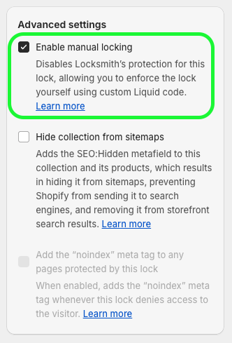

# Hiding prices with manual code

Most stores should use Locksmith's built-in price and buy-button hiding, which needs no theme code at all:


[hiding-prices.md](../hiding-prices.md)


This page covers the manual alternative. Reach for it when the automatic settings report **Incompatible** for your theme, when prices come from somewhere Locksmith's own integration can't see, or when you want to hand-place the message yourself.


You don't have to do any of this yourself. If you've created your lock already, write to us at [team@uselocksmith.com](../../policies/contact.md) and we'll do the coding for you.


The rest of this guide shows how to set up price hiding manually in your theme, using Locksmith's [manual mode](manual-mode.md) feature — an approach that can still be useful for special cases.

## Enable manual mode

Before saving your lock, turn on "Enable manual mode" right there in the lock (Clicking "Advanced" will show the option):



## Updating your theme for manual locking

You'll now need to let Locksmith know which parts of the page should be hidden. There are two methods to handling this:<br>

## Theme hiding profiles:

This method allows you define sections, blocks, or snippets which Locksmith will hide based on locks that have the Manual Locking option enabled.

This method shouldn't require any coding in your theme, _if_ your theme is fully compatible. (Most modern themes are.) This is a newer feature, and we recommend trying this method first.

Here's a complete guide to setting this up:


Theme hiding profiles: Hide prices without coding.


## Using manual locking code in your theme:

**Because each theme is a bit different, adding manual locking code will require manually editing your theme to hide your pricing or add to cart buttons.**

**If you install a new theme down the road, these changes will need to be re-applied.** Try the the Theme Hiding Profiles method first (outlined above), to avoid these limitations.

The rest of this guide gets a bit technical, we'll happily to the coding portion for you! If you've already created your lock (see [step 1 of the main guide](../hiding-prices.md#id-1.-create-a-lock)), simply write us a message at **team@uselocksmith.com** to request help.


**Note:** Locksmith's manual locking feature generally can _**not**_ hide elements or sections that are being managed or displayed by other third-party apps, including page builder apps.\
\
Manual locking is only compatible with full-page locks, and is _**not**_ compatible with variant locks.


If you are a developer type, and prefer to do the coding portion yourself, read on...\
\
You'll need to start by locating the places in your theme that show the price. Here are some examples of files that you might find the price in:

* snippets/product-card-grid.liquid
* templates/product.liquid
* snippets/product-card-list.liquid
* snippets/product-price.liquid

Each theme is very different, so those are simply examples. You'll need to go to each of the files that display price, and do the following steps:

1.  Open up the Liquid file, and add this to the very top of the file:

    <pre class="language-liquid" data-overflow="wrap"><code class="lang-liquid">
    </code></pre>
2.  Find the code you want to hide from unauthorized viewers, and wrap it with:

    <pre class="language-liquid" data-overflow="wrap"><code class="lang-liquid">
      &#x3C;!-- your price code here -->
    
    </code></pre>
3.  To hide prices, you'll be looking for elements like:

    ```liquid
    {{ product.price }}
    ```

    ... or:

    ```
    {{ item.price }}
    ```

    **Example:**

    

    This shows Locksmith manual locking code wrapping an entire price section, which I've highlighted.
4. Save!

Remember, those 4 steps need to be done for each file that display the price.


In many cases, the above code only needs to be added to two or three files. Whichever file is in charge of displaying the price on **product** pages, **collection** pages, and **searches**. The latter two are oftentimes the same.


## Configuring Locksmith to hide the add-to-cart button only <a href="#hide-add-to-cart" id="hide-add-to-cart"></a>

You can still restrict purchasing products, while leaving the product details visible to the customer. This also a good option for those wanting to make sure that products are **available for search engines to index**.

**As a reminder**, we can help guide you through this process, including adding the code, so don't hesitate to get in touch.

Step 1 is exactly the same, but the code you add in step 2 will be slightly different.

Find the product-template or product-form file in your theme, and locate the code that generates the "add-to-cart" button. This is different for all themes, so it won't be possible to give you an exact location for this. Then, add the code that you want to render, inside of a Liquid "else" statement. For example:


```liquid



  <button type="submit">
    Add to cart button example
  </button>

  <p><strong>Product not available</strong></p>

```


This results in the add-to-cart button being replaced, in cases where the customer doesn't have access. What is shown depends on what is added above. Just make sure your key conditions on the lock match the conditions that you want your customers to meet before being able to purchase.

### For stores using Shopify's [legacy customer account system](https://help.shopify.com/en/manual/customers/customer-accounts/legacy-customer-accounts) (formerly "Classic customer accounts"):

If you need to render a "Login to purchase" button, use the following code (the button classes may need to be edited). This button includes a redirect to return customers after login:


```html
<a href="/account/login?return_url={{ request.path }}" class="btn button button button--full-width button--secondary">Log in to purchase</a>
```


### For stores using Shopify's [customer account](https://help.shopify.com/en/manual/customers/customer-accounts/new-customer-accounts) system (formerly "New customer accounts":

If you need to render a "Login to purchase" button, use the following code (the button classes may need to be edited). This button will return customers after login:


```html
<a href="/customer_authentication/login?locale={{ request.locale.iso_code }}&return_to={{ request.path | url_encode }}" class="btn button button--full-width button--secondary">Log in to purchase</a>
```


### For locks using passcode keys:

If you need to render a passcode prompt button, use the following code (the button classes may need to be edited):


```html
<button class="locksmith-manual-trigger btn button">Enter passcode to purchase</button>
```


### For locks using location keys:

You can add an access denied message of location keys by adding paragraph tags and some text within the Liquid "else" statement, for example:

```html
<p><strong>Product not available in your country.</strong></p>
```

### When using the "is tagged with..." key condition you can display a "Login to purchase" button _or_ an access denied message depending on a visitors access:

<details>

<summary>Click here for an example</summary>

The following example includes an "else" statement that will:

* display an access denied message to customers who _are_ signed in and _don't_ have access to the lock.
* or a "Login to purchase" button for customers who aren't signed in.

```


  <button type="submit">
    Add to cart button example
  </button>


  
  

    <p style="font-weight: bold; padding-top:20px; padding-bottom:20px;">You do not have access to this resource.</p>

      <a style="width: 100%;" href="/customer_identity/sso_hint" class="btn button" data-locksmith>Log in to purchase</a>

  

```

**Note:** The above example uses a "Login to purchase" button for Shopify's [standard customer accounts](../hiding-prices.md#for-stores-using-shopifys-customer-account-system-formerly-new-customer-accounts) system.

</details>

## Here are some visual examples of the result

### Requiring, a sign-in:


### **A passcode:**


### **A country-specific visitor:**



Please note: since the custom liquid code is added manually to the store theme, anytime you switch to a _**new**_ or _**updated**_ theme the custom code has to be manually added again to the new theme. We're always happy to add code to new or updated themes if you write into [team@uselocksmith.com](../../policies/contact.md)\
\
We recommend leaving the new theme _unpublished_ while you wait for the code to be added, so that nothing is exposed in the meantime. :)



If Locksmith's custom manual locking code is added to an _**unpublished**_ theme, please be sure to visit our guide below for instructions on testing:\
\
[testing-locksmith-on-unpublished-themes.md](testing-locksmith-on-unpublished-themes.md "mention")

