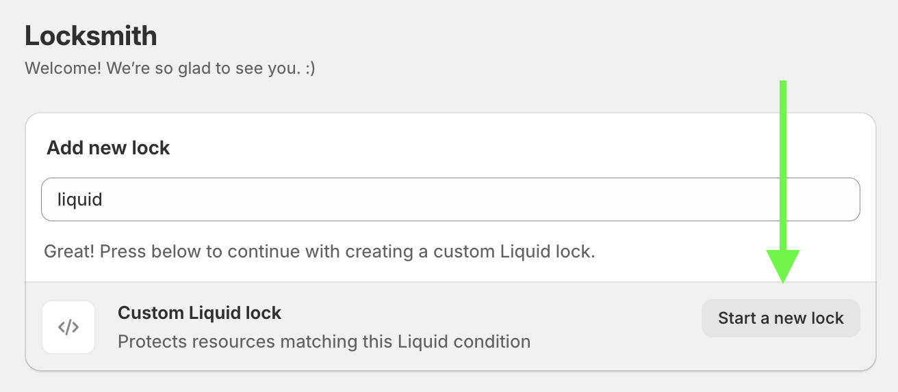
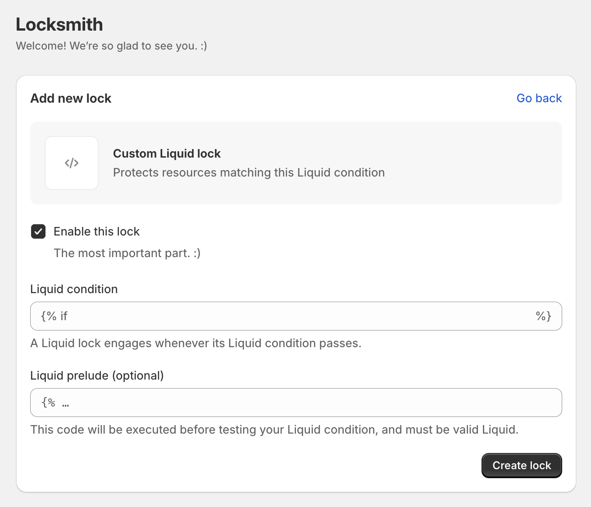

# Liquid locking basics

Locksmith has a feature to create "Liquid" locks, which allows you to lock pages in your store that are otherwise not searchable using the basic "Add lock" resource search in Locksmith.


This is an advanced guide that requires knowledge of [Shopify's Liquid language](https://shopify.dev/api/liquid). If you're a developer type, read on! Otherwise, please note that Locksmith support is not able to write advanced custom Liquid locks for you. While we are happy to answer any questions you have along the way, if you need help writing these, you'll need to hire a paid Shopify expert. [Our list of partners is here](https://locksmith.partnerpage.io/). Alternatively, you can check [Shopify's own list of Shopify experts](https://www.shopify.com/partners/directory).


Moving on - to begin, click in the "Add a new lock" search field and select "Start a Liquid lock", or type "Liquid" in the search field:


Then click "Start a new lock":

<figure><figcaption></figcaption></figure>

This will bring up the following form:

<figure><figcaption></figcaption></figure>

## The "Liquid condition"

The "Liquid condition" is the condition that is evaluated to decide if the lock will be engaged on the current page. The Liquid condition simply needs to evaluate to true or false.

All liquid objects in Shopify are fair game here, [more info on Liquid objects here](https://shopify.dev/api/liquid/objects).

**Useful examples**

Any condition that evaluates to true will result in a locked page. So, imagine if you created a lock with this condition:

```



```

That would result in every single page in your store becoming locked. This isn't advisable, it's just a proof of concept :)

***

One of the most useful variables that you can use is the **canonical\_url** variable. This variable contains the full url of the current page, so it is a good way to lock pages that aren't usually searchable. For example you have an app that lives at _my-store.myshopify.com/apps/bulk-order-form-app_, you could lock it with the following condition:

```



```

***

Another useful variable is the **template** variable. For example, an easy way to lock _only_ the home page would be:

```



```

If your home page template is called something else, you have the flexibility to lock it by adjusting the condition above.

## The "Liquid prelude"

The "Liquid prelude" will be evaluated _before_ the liquid condition, and is where you'll add any code that helps you set up the Liquid condition, and can span multiple lines. For example, you can assign to a specific custom variable, which can then be used the the Liquid condition later.

For example, if you have a large number of pages that you want to lock at once, normally you'd need to do that by creating a separate lock on each page. You could use the Liquid lock feature to lock them all at once. Perhaps something like the following:

In your Liquid **prelude**:

<pre><code><strong>
</strong>
 
  
 

</code></pre>

In your Liquid **condition**:

```



```

This would result in all "Pages" in your store that contain "member" or "secret" in the title becoming locked.

## Related resources

You can also create Liquid keys! While the function of Liquid keys is fundamentally different than what is covered on this page, the concepts while setting them up are very similar:


[liquid-key-basics.md](../../keys/more/liquid-key-basics.md)



[locking-multiple-pages-at-once.md](locking-multiple-pages-at-once.md)

