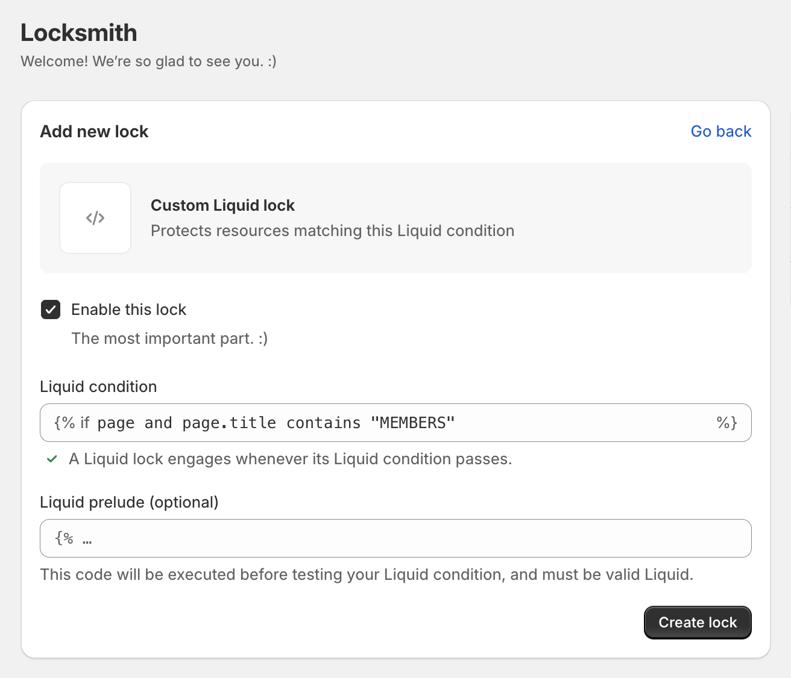
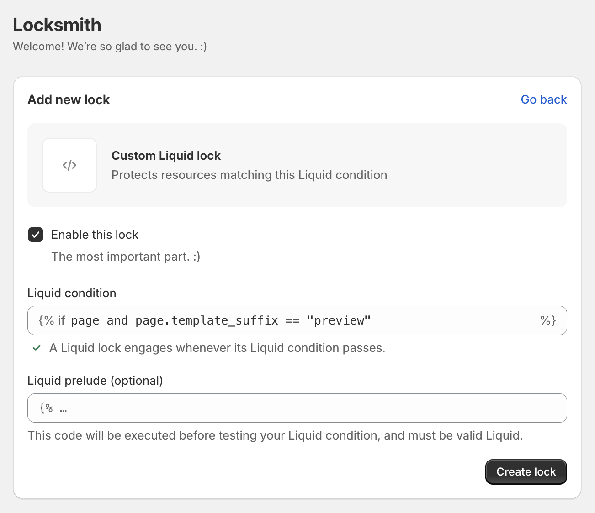
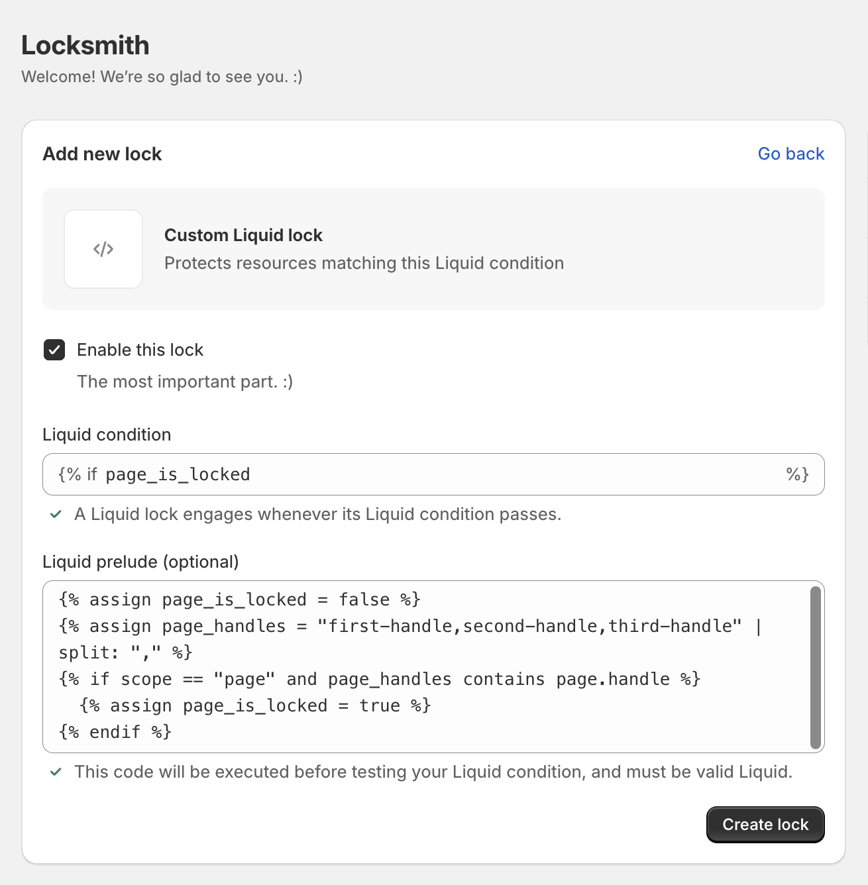
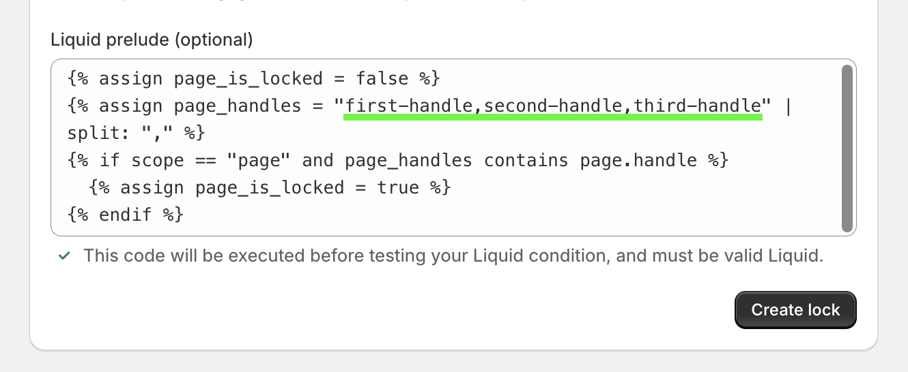

# Locking multiple pages at once

Because Shopify doesn't provide any way to group pages (in the way that collections work for products), we need to get down to the code level in order to protect more than one page at a time.

To get started, you'll need to begin a "Liquid lock:


[liquid-locking-basics.md](liquid-locking-basics.md)


## Lock all pages containing a certain word:

To lock all pages containing a certain word in the title, fill out the Liquid lock form like so:



Example code for "Liquid condition" from above image:

```
page and page.title contains "MEMBERS"
```

Submit the form to create your lock, then proceed by configuring keys as appropriate.

## Lock all pages that use a certain custom template:

To lock all pages that use a certain custom template, use this:



Example code for "Liquid condition" from above image:

```
page and page.template_suffix == "preview"
```

Submit the form to create your lock, then proceed by configuring keys as appropriate.

## Lock a list of pages by page handle:

To lock a list of pages based on page handles using one lock:

<figure><figcaption></figcaption></figure>

To list pages handles that you would like to lock, you can do that by listing each handle in the "Liquid prelude" field where the "page\_handles" variable is defined (see image below).&#x20;

<figure><figcaption></figcaption></figure>

You can replace "first-handle,second-handle,third-handle" with your own handles and list additional handles by adding a comma "," between each handle with no spaces.

**Liquid condition:**

Example code for the "Liquid condition" from above image:

```
page_is_locked
```

**Liquid prelude:**

Example code for the "Liquid prelude" from above image:

```



  

```

Submit the form to create your lock, then proceed by configuring keys as appropriate.

## Lock pages using a metafield

If your pages don't share a common word in the title, don't use a shared custom template, and you'd rather not maintain a long list of page handles, you can use a [**page metafield**](https://help.shopify.com/en/manual/custom-data/metafields) to control which pages are locked. This approach is especially useful when you have a large number of pages built with different templates or page builders.

**The idea:** create a custom metafield on your pages, and then create a single Liquid lock that checks whether that metafield has a value. Any page where the metafield is populated will be locked automatically.

#### Step 1: Create a page metafield definition in Shopify

1. In your Shopify admin, go to **Settings > Custom data > Pages**.
2. Click **Add definition**.
3. Give it a name (for example, `locksmith_locked`) and set the type to **Single line text**.
4. Save the definition.

#### Step 2: Set the metafield value on pages you want to lock

1. Open each page you want to lock in the Shopify admin.
2. Scroll down to the **Metafields** section at the bottom of the page editor.
3. Enter any value in your new metafield — it can be anything, such as `locked`, `true`, or a tag name. The important thing is that it's not blank.
4. Save the page.


**Tip:** Shopify's built-in bulk editor does _not_ currently support pages, so metafield values need to be set on each page individually through the Shopify admin. If you have a large number of pages to update, a metafield management app from the Shopify App Store or the Shopify API can help speed this up — though both options fall outside the scope of Locksmith support and may require a developer.


#### Step 3: Create the Liquid lock

Follow the steps in our [Liquid locking basics](https://www.locksmith.guide/tutorials/more/liquid-locking-basics) guide to begin creating a Liquid lock, and fill in the fields as follows:

**Liquid condition:**

```
page and page.metafields.custom.locksmith_locked != blank
```

<figure><figcaption></figcaption></figure>

\
No Liquid prelude is needed for this approach.

Submit the form to create your lock, then proceed by configuring keys as appropriate.

#### How it works

This lock checks two things: that the current page is a page (not a product, collection, etc.), and that the page has a non-blank value in the `custom.locksmith_locked` metafield. If both are true, the page is locked.

To lock a new page in the future, you just set the metafield value on that page — no need to edit the lock itself. To unlock a page, clear the metafield value.

#### Optional: Use the metafield value as part of your key logic

You can take this a step further by putting a **customer tag name** in the metafield value (for example, setting the metafield to `vip` on one group of pages and `members` on another). This opens up the possibility of using the metafield value in more advanced Liquid key conditions, allowing different groups of pages to require different access levels — all within a single lock. This kind of setup falls into advanced Liquid territory and may require a developer to implement.

## Additional notes:

If you'd like to use something other than the title or template to activate this lock, take a look at [Shopify's Liquid documentation for pages](https://docs.shopify.com/themes/liquid/objects/page) - you can adapt your custom lock for any of the page attributes listed there.

## Related articles


[liquid-locking-basics.md](liquid-locking-basics.md)

