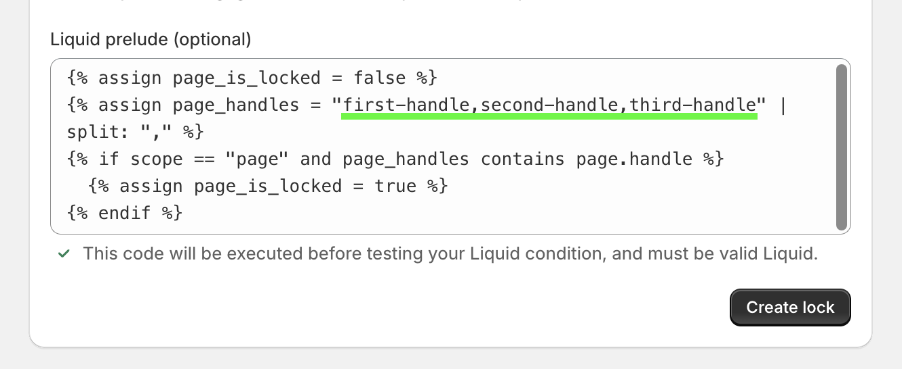

# Locking multiple pages at once

Because Shopify doesn't provide any way to group pages (in the way that collections work for products), we need to get down to the code level in order to protect more than one page at a time.

To get started, you'll need to begin a "Liquid lock:


[liquid-locking-basics.md](liquid-locking-basics.md)


## Lock all pages containing a certain word:

To lock all pages containing a certain word in the title, fill out the Liquid lock form like so:


Example code for "Liquid condition" from above image:

```
page and page.title contains "MEMBERS"
```

Submit the form to create your lock, then proceed by configuring keys as appropriate.

## Lock all pages that use a certain custom template:

To lock all pages that use a certain custom template, use this:


Example code for "Liquid condition" from above image:

```
page and page.template_suffix == "preview"
```

Submit the form to create your lock, then proceed by configuring keys as appropriate.

## Lock a list of pages by page handle:

To lock a list of pages based on page handles using one lock:

<figure><figcaption></figcaption></figure>

To list pages handles that you would like to lock, you can do that by listing each handle in the "Liquid prelude" field where the "page\_handles" variable is defined (see image below).&#x20;

<figure><figcaption></figcaption></figure>

You can replace "first-handle,second-handle,third-handle" with your own handles and list additional handles by adding a comma "," between each handle with no spaces.

**Liquid condition:**

Example code for the "Liquid condition" from above image:

```
page_is_locked
```

**Liquid prelude:**

Example code for the "Liquid prelude" from above image:

```



  

```

Submit the form to create your lock, then proceed by configuring keys as appropriate.

## Additional notes:

If you'd like to use something other than the title or template to activate this lock, take a look at [Shopify's Liquid documentation for pages](https://docs.shopify.com/themes/liquid/objects/page) - you can adapt your custom lock for any of the page attributes listed there.

## Related articles


[liquid-locking-basics.md](liquid-locking-basics.md)

