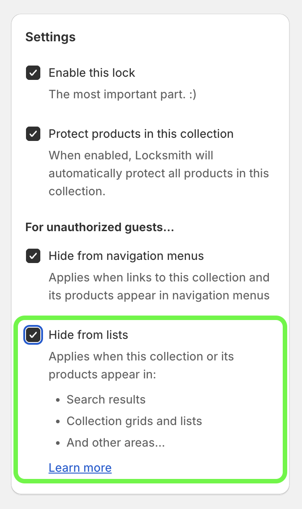

# Locking products by tag

Locksmith won't lock by tag using the Locksmith search bar. Create a collection that automatically includes products with a given tag, using conditions. Shopify previously called this a smart collection.

Learn how to create a collection: [https://help.shopify.com/en/manual/products/collections/create-collection](https://help.shopify.com/en/manual/products/collections/create-collection)

Learn about collection conditions: [https://help.shopify.com/en/manual/products/collections/conditions](https://help.shopify.com/en/manual/products/collections/conditions)

1\. In your Shopify admin, go to _Products_ > _Collections_.

2\. Click _Add collection_.

3\. Enter a title for the collection.

4\. In _Products source_, click _Add condition_. Select the product tag attribute, then enter the tag.

5\. Click _Save_.

<figure><figcaption></figcaption></figure>


If your store still uses Shopify's older collections model, choose _Smart_ when creating the collection. Set the condition to _Product tag is equal to_, then save the collection. More details: [https://help.shopify.com/en/manual/products/collections/smart-collections](https://help.shopify.com/en/manual/products/collections/smart-collections)


Once that's done, search for your new collection by name in the Locksmith search bar, and lock it that way. You'll likely want to enable the "hide from search and lists" option on that collection lock.

Any time you tag a new product with that tag, it'll automatically be in that collection and therefore locked by Locksmith. :)

#### "What happens in the other collections that these products are in?"

Once you create your collection lock, you'll be presented with these options:

<figure><figcaption></figcaption></figure>

The highlighted "Hide from lists" option here controls whether or not the tagged (and therefore locked) products will appear elsewhere. With the option enabled, Locksmith will automatically hide these products (unless the customer is already qualified for access). In that scenario, the customer _will_ be able to see the products in your other collections – they won't be prompted for access until they click through to an individual product. With the option _disabled_, the products will remain visible in your other collections. (Note that the customer will still be prompted for access when they click through to a product, even in this scenario.)
