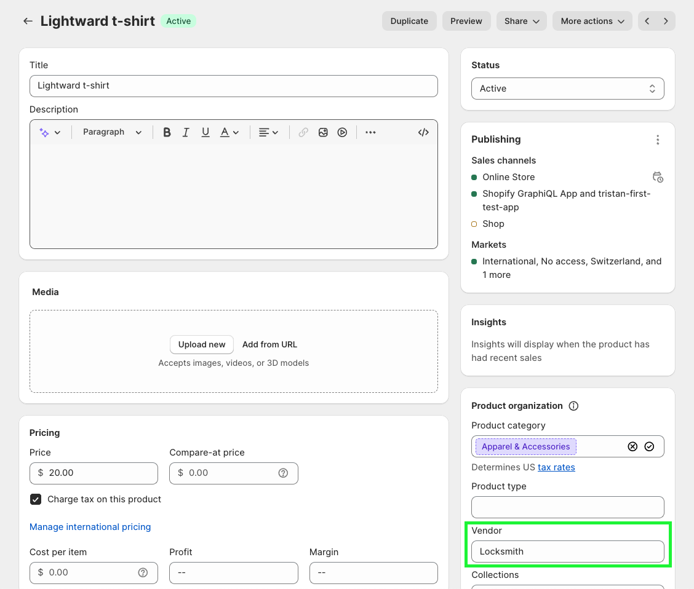
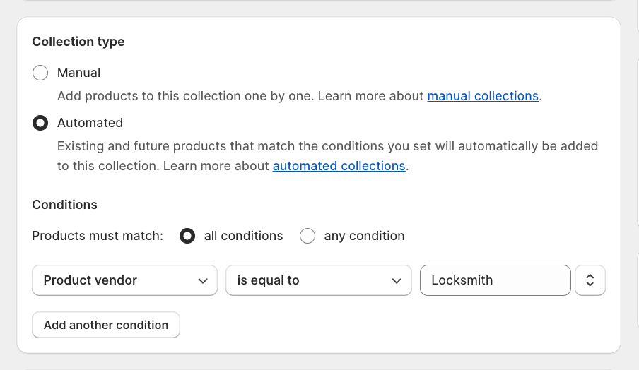

# Locking products by vendor

Locksmith can search for and lock products based on the product vendor. A lock can be created for all products from a specific vendor by searching for the name of that vendor in the search bar on the Locksmith app's homepage.

<figure><figcaption>
Image 1. Example of a vendor search where the vendor name is "Locksmith".
</figcaption></figure>

Shopify's product vendors are part of the organization section on a products information page. More on that in the Shopify's guide below:

<figure><figcaption></figcaption></figure>

[Shopify Product details - Organization](https://help.shopify.com/en/manual/products/details#product-organization)

## Vendor locks vs Collection locks

### Similarities:

* Vendor locks work in a similar way to collection locks: where a single lock can be used to hide and manage access to multiple products.&#x20;
* Vendor locks and collection locks both have a "Hide this vendor/collection and their products" option. That can be used to tell the lock to filter locked products from the store's native search and collection lists.


[can-locksmith-hide-content-from-my-in-store-search.md](../../faqs/can-locksmith-hide-content-from-my-in-store-search.md)


### Differences:

* Collection locks have a "Hide any links to this collection and its products" option that vendor locks do not. This option can be used to hide menu navigation links for locked products in a collection from the stores native header and footer menus.
* Collections can be used to present a specific group of products in one place. When the collection is locked Locksmith will present an access message and content relevant to the locks key conditions. \
  \
  This is useful if you would like to present a central location to send customers to that contains restricted products they should have access to.

## Creating a collection that for vendors

This section covers using your Shopify admin to create a custom automated collection that includes products based on product's vendor

1. In your Shopify Admin, navigate to Products > Collections
2. In the upper right, click Create Collection
3. Name your collection something relevant, and then scroll down and click on the Automated option for the collection.&#x20;
4. In the conditions area, choose "Product Vendor... is equal to" and then add your product Vendor into that field:&#x20;

<figure><figcaption></figcaption></figure>

5. Click Save.

Once your collection has been set up, search for your new collection's title in the search bar on the Locksmith homepage, and create your lock. You'll likely want to enable the "hide from search and lists" option on that lock.

Any time you add that vendor to a product, it'll automatically be included in that collection and therefore locked by Locksmith. :)

## Related articles


[creating-locks.md](../../basics/creating-locks.md)



[locking-products-by-tag.md](locking-products-by-tag.md)


## Something else not covered here?

Let us know by emailing us at: **team@uselocksmith.com**
