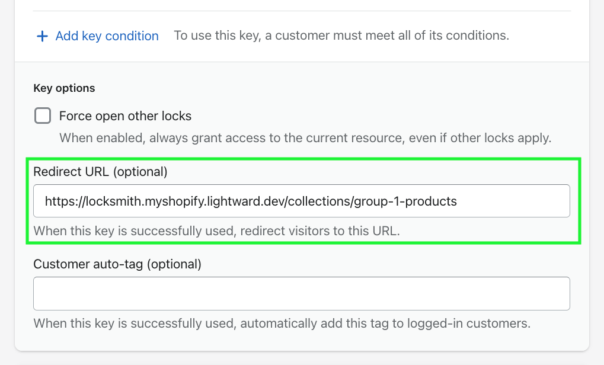

# Redirecting using Locksmith

Out of the box, when a Locksmith lock is activated on a specific page, Locksmith will block acess to the _main content_ of the page (i.e. everything in between the header and footer). The main content will then be replaced by Locksmith's access denied content, which might be a sign-in page, a passcode prompt, or simply a message letting the customer know that they don't have access (depending on what keys and settings you are using).

Then, of course, once a customer gains access, they will be shown the content of the page normally.

While that is the default behavior, you also have the ability to send customers to a different page **before** or **after** they gain access to the content. So in this way, there are **two types of redirecting** - redirecting customers right away once they arrive on the locked page, or redirecting customer once they gain access.

## Redirecting customers immediately when they arrive on a locked page - _before_ they can gain access

To redirect customers this way, you'll simply use a regular Javascript redirect script, and enter it into the "Messages" area in Locksmith. More information on the messages area here:


[customizing-messages](customizing-messages/)


This is an example of a simple redirect script:

```
<script>
  window.location = 'https://www.example.org/my-example-page-url';
</script>
```

The only thing you'll need to change is the exact URL. Use the full URL whenever possible (as opposed to partial URLs).

In Locksmith, this will look something like the following:



**Tip!** Redirect scripts can be used on any type of key condition, including customer account keys, passcodes, secret links, etc.


Also keep in mind that in the case of customer account keys, you have the option to define different messages(or behavior, in this case) based on whether or not the customer is signed in when they arrive on the page. So, you could redirect customers that were signed in (but still didn't have access), for example. This would look like the following:


### Redirecting customers to a login form and returning them after signing in


**Important notes:** By default, Locksmith will present the theme's login form in place of locked resources for key conditions that require a customer to sign into a store account. Once signed in, Locksmith will also return customers to the resource they were trying to access.

This redirect is only necessary for certain issues or requirements from the store's login form.\
\
When using this redirect, Locksmith won't be able to display the lock's access message content along with the login form to which customers are redirected.


Sometimes, a theme's login form will include features that Locksmith is unable to present when replacing locked resources with Locksmith's access denied content. This redirect is a good way to ensure customers see the correct login form.


Note: If your login form isn't loading correctly when presented by Locksmith, please let us know by emailing us at [team@uselocksmith.com](mailto:team@uselocksmith.com).


The following code provides an example of a JavaScript redirect that automatically redirects customers to the default login form in a Shopify store. This script includes a variable that captures the customer's current URL and sets it as the return URL after signing in. \
\
This script can be pasted into the "Guest messages content" area in Locksmith.

```
<script>
    var current_url = encodeURIComponent(window.location.pathname);
    window.location.replace("/account/login?return_url=" + current_url);
</script>
```

<figure><figcaption></figcaption></figure>

## Redirecting customers _after_ they've gained access

Locksmith also has the ability to redirect customers once they've arrived to a page that they have access to. This could be useful if you wanted to show different pages to different customers once they've gained access. **Passcodes** is an area that this is frequently used for.

So - for example: three customer groups that each need to see a different collection. If I have a landing page that I put a Locksmith lock on, we can use the redirect feature to send each customer to a different collection, _depending on which passcode they've entered_.

The redirect-after-access feature is found in the key settings, accessed with the edit link to the right of each key:

-2.0.png)

The Redirect URL field is in the Key options section, at the bottom of the keys settings card:

<figure><figcaption></figcaption></figure>

Since this is a key setting, you can set a different redirect for each key. Notice in this example that each key is redirecting to a different collection URL:

-2.0.png)


If you enter the same URL for the redirect as any of the lock's contents, then when a customer uses that key, the result will be an infinite loop. To prevent this from happening, you'll want to avoid adding redirect links to pages that are covered by the same lock.&#x20;


## Redirecting customers from the product page to the parent collection page _before_ access is granted:&#x20;


This redirect is useful for merchants who would like to ensure customers land on the collection page, in case a customer first arrives directly via a product URL.


To redirect customers in this way, you can use some Liquid code to check if a customer is on a product page and then include a regular JavaScript redirect script within that Liquid. This code can be entered into the "Guest message content" field or "Passcode prompt" area on the collection lock's settings page. More information on the messages area here:


[customizing-messages](customizing-messages/)


The following code provides an example of some Liquid and a JavaScript redirect that automatically redirects customers to a collection page from a product page in a Shopify store. The Liquid code checks for the default product template to prevent the script from running on the collection page. This script includes the URL that can be modified to redirect customers to the collection page for the locked collection.

This script can be pasted into the "Guest message content" field or "Passcode prompt" field on the respective collection lock's settings page.

<pre><code>
  &#x3C;script>
    window.location = 'https://example-store.myshopify.com/collections/example-collection';
<strong>  &#x3C;/script>
</strong>
</code></pre>


**Notes:**&#x20;

* This should only be added to the "Guest message content" field or "Passcode prompt" field on a collection lock's settings page, and not to message fields on the app's settings page. Otherwise, the script will be run for all collection locks.
* The JavaScript redirect's URL will need to be set to match the collection URL for the collection that the lock has been set up to protect.
* The default product template has been used in this example. If your products use a custom template, you will need to adjust the Liquid to check for that custom template, or for custom and default product templates.


## Related articles


[passcode-specific-redirects.md](passcode-specific-redirects.md)



[customising-locksmiths-access-denied-content-messages-and-redirecting-customers.md](customizing-messages/customising-locksmiths-access-denied-content-messages-and-redirecting-customers.md)

