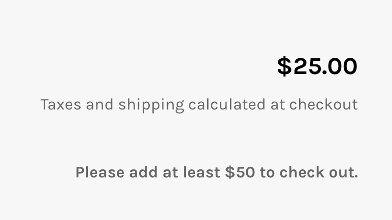

# Restricting checkout from the cart

Locksmith allows you to restrict checkout by using a lock on the cart page in your store. **This is a good choice for merchants who want to allow customers to view all content in their store and browse fully,** only adding in restrictions on the last page before checkout. Or, to simply add extra restrictions for checking out, on top of other locks in the store.&#x20;

### **Limitations:**

* The method locks down the cart page only. The cart page is always found at the '.../cart' link in your store (e.g. www.example-store.com/cart). Using other types of carts (slider, dropdown, dynamic/ajax, etc.) or adding "Buy Now" links to your store (which point the customer directly to checkout without going through the cart page) will not work with this method.
* Locking the checkout area itself is not possible using Locksmith. So any check out links that lead straight to checkout including "Buy Now" button, upsell links, or abandoned cart links can't be used with this method. Please see: [setting-up-checkout-validation-with-locksmith.md](setting-up-checkout-validation-with-locksmith.md "mention")

\
Moving on, this is the checkout page without any locks in effect:


You can lock the entire cart page if preferred. This will work just like any other Locksmith lock. However, it is also possible to take it further and lock only the "Check out" button. Once Locksmith is set up, the result will be something like one of these screenshots (depending on your settings):

&#x20;



\------


## Part One: Creating the lock

Use the following steps

1\. Open up the Locksmith app and search and for "cart" and click on it, or select it after clicking into the search bar when it comes up in the search dropdown:


2\. On the next page, under "Keys", you'll add in your conditions. Here are some of the more common conditions used...

**To impose a minimum purchase amount:**

<figure><figcaption></figcaption></figure>

\
**To make sure only customers that are signed in and have approved accounts can proceed:**

<figure><figcaption></figcaption></figure>

\
**Customer must enter a passcode to checkout:**

<figure><figcaption></figcaption></figure>

\
3\. If you just want to lock the entire cart page, click "Save" to finish. If you want to lock _only_ the "Checkout" button, make sure "enable manual locking" is checked under Advanced Settings before saving:

.png>)

Done with part one!

If you need help with setting up more complicated checkout conditions, Locksmith may be able to help. Just get in touch with us :)

## Part two: Theme changes


_New to manual locking?_ [_Check out our general introduction_](../../keys/more/manual-mode.md)_._


Some modifications to your shop's theme will need to be done to protect just the checkout button.


**Because each theme is a bit different, this feature&#x20;**_**does**_**&#x20;require manual coding.** If you install a new theme down the road, these changes will need to be re-applied.


The rest of this guide gets a bit technical! We can take care of adding the code for you for you, no problem, so if you're interested, get ahold of us.

#### **Rather do it yourself?** Keep reading...

In this portion, you'll update your shop's theme to protect _just_ the checkout button(s) on your cart, allowing your visitors to manage their cart but not check out until they meet your criteria.

1. From your Shopify admin area, navigate to "Online Store" -> "Themes". Then, click the three-dots button in the upper-right corner for your theme, and select the "Edit HTML/CSS" option.
2. Open the "cart.liquid" file (under "Templates"). If you have a newer "sectioned" theme, you may actually need to edit the "cart-template.liquid" file (under "Sections")
3. Add the following to the very top of the file:``&#x20;
4. Find the checkout submit button(s), and wrap this code with ` ... ` . You can also add an "else" section to show a message to anyone who's been prevented from checking out.Here's a pretty typical example:

Before:

```
<input type="submit" name="checkout" class="btn" value="{{ 'cart.general.checkout' | t }}">



  
 <div>
  {{ content_for_additional_checkout_buttons }}
 </div>


```

After:

```


  <input type="submit" name="checkout" class="btn" value="{{ 'cart.general.checkout' | t }}">

  
    
 <div>
  {{ content_for_additional_checkout_buttons }}
 </div>
  

  <p>Please add at least $50 to your cart to check out.</p>


```

Save the template, and you're done! :)

## Other considerations:

### Clearing the cart when a customer signs out:


**Note:** The script used here isn't an officially supported Locksmith feature. The following is an example of a script that's commonly used to clear a customer's cart when they log out.


Some merchants set up their cart restrictions so that they only apply to certain signed-in customers and the exclusive products they have access to. In this case, it might be possible for customers to sign out to bypass these conditions once restricted products have been added to the cart. If that applies to you, consider ensuring that all products are removed from the cart when a customer signs out.

You can achieve this by adding the following JavaScript to your **layout/theme.liquid** file, just before the closing tag:

```
<script>
  $(document).on('click', 'a[href="/account/logout"]', function (e) {
    e.preventDefault();
    $.ajax({ method: 'POST', url: '/cart/clear.js' }).always(function () { window.location = '/account/logout'; });
  });
</script>
```

This will clear the cart when the logout button is pressed, preventing that workaround.

If this script doesn't work in your theme, your theme may not include jQuery libraries. To include those libraries, the following script can be added to an empty line right before the cart clearing script mentioned above.

```
<script src="https://ajax.googleapis.com/ajax/libs/jquery/3.5.1/jquery.min.js"></script>
```

## A note about Abandoned Cart emails

If you have abandoned cart emails enabled on your shop, either through the built-in Shopify feature or an app, those emails may allow the customer to circumvent checkout restrictions.&#x20;

These emails can send the customer directly to the checkout process without touching the cart page. The customer will be able to check out with whatever amount was in the abandoned cart, whether or not it passes your restrictions.&#x20;

**Your checkout restrictions will not work 100% of the time if you're sending abandoned cart emails**_,_ so keep that in mind when you're setting this up. :)
