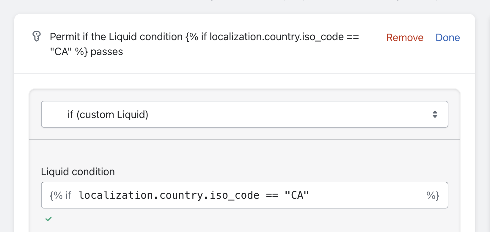

# Showing content only to specific Markets

Locksmith can be used to show different content depending on what Market a customer is visiting.

The first step is to divide up the content in your store. If you already know what products or collections you want to show or hide in different Markets, then you do not need to create extra collections here.&#x20;

Since the goal for merchants here is typically to just to show a different product offering to different markets, you'll want to create collections that each contain the products that you'd like to display for each market. Keep in mind that you can use [Shopify's automated collection feature](https://help.shopify.com/en/manual/products/collections/automated-collections/auto-create) to make this easier. Once your collections are created, it's simply a matter of adding a lock to them in Locksmith:


**Note**: You are not limited to locking only collections or products in this way. You could also lock pages or variants, for example. In this case, you'd just need to create the variants or pages that you want to display for each Market.


Once the lock is created, you'll need to create the correct Locksmith "Key". Markets are typically set up by either creating _subdomains_ on your store, or by creating _subfolders_. **Depending on which one of those you are using, you'll need to set up Locksmith a bit differently...**

## When using subdomains

This will usually look something like www.my-store.eu, or ca.my-store.com, where the subdomain of the URL represents a different region that you're selling to. In this case, simply use Locksmith's "domain" key condition:&#x20;

<figure><figcaption></figcaption></figure>

When setting this up, Locksmith will automatically show you suggestions for which domain to use, based on the domain settings for your store.

## When using locale + country subfolders

This will usually look something like www.my-store.com/en-us or www.my-store.com/fr-ca. In this case, your key conditions will look slightly different. Start by selecting the ["custom Liquid" key condition](../../keys/more/custom-liquid-key-condition-basics.md):

<figure><figcaption></figcaption></figure>

Next, you'll add in something like the following as the "Liquid condition", making sure to edit the last part to match the subfolder you are wanting to grant access to:

``

Note that only the bolded part needs to be entered, as the rest is included automatically.

You'll end up with something like this:

<figure><figcaption></figcaption></figure>

If you want to set up a key condition for your primary domain, use "/" as your root\_url. In specifically: \
\
``

## Using the "localization" object

Similar to the above, you can also use the Liquid localization object in your custom key condition. This is useful if you don't use subfolders. Shopify's documentation on the localization object is here: [https://shopify.dev/docs/api/liquid/objects/localization](https://shopify.dev/docs/api/liquid/objects/localization).&#x20;


**Important!** Using this feature doesn't mean you can use any arbitrary country in your condition. It will only work for the countries that you've set up localization options for in your store. If you want to grant access to visitors based on their IP address location, that can be done with our "locations" key condition: [https://www.locksmith.guide/keys/visitor-location-keys](https://www.locksmith.guide/keys/visitor-location-keys).


Your condition will look something like the following - where "CA" is the ISO code for Canada: \
\
``

<figure><figcaption></figcaption></figure>

A list of country ISO codes can be found here:  [https://shopify.dev/docs/api/storefront/2022-10/enums/countrycode](https://shopify.dev/docs/api/storefront/2022-10/enums/countrycode)
